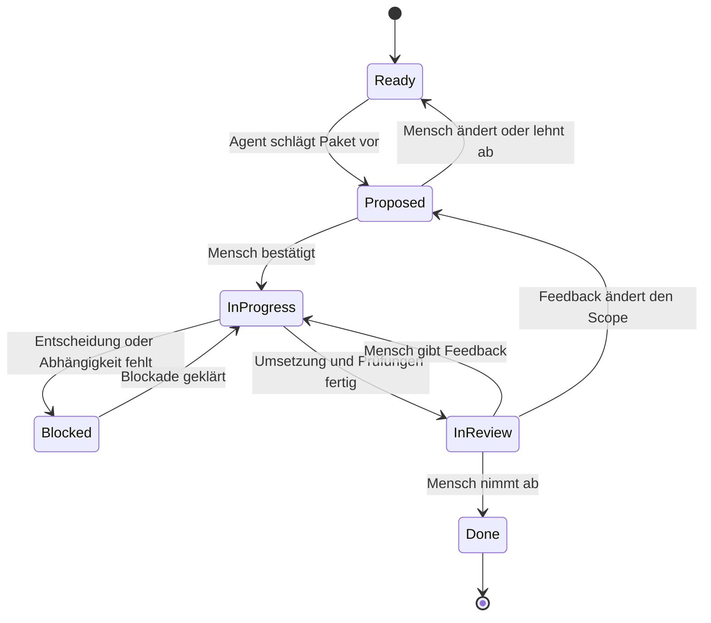

# Technisches Handoff: Cross-Plattform-Jira-Desktop-App

## Auftrag

Entwickle eine neue native Desktop-Oberfläche für Jira Cloud. Die Anwendung soll auf Windows 11, Linux und macOS laufen. Die Board-Ansicht ist das Zentrum des Produkts. Ticketbewegungen und Workflow-Transitionen sollen sich flüssig, hochwertig und teilweise wie in einem guten 2D-Spiel anfühlen. Ein über Microsoft Teams geteilter Bildschirm mit 1920 × 1080 Pixeln ist der wichtigste Referenzfall; höhere Auflösungen, Ultrawide-Displays und benutzerdefinierter App-/Schriftzoom gehören ebenfalls zum verbindlichen Layoutumfang.

Die Anwendung ist ein AI-first-Projekt. Architektur und Code sollen deshalb explizit, stark typisiert, gut testbar und für Coding-Agenten leicht verständlich sein. Trotzdem muss der erzeugte Code durch Menschen prüfbar und langfristig wartbar bleiben.

## Verbindlicher Produkt- und Jira-Geltungsbereich

Die erste Auslieferung darf intern erfolgen, die Architektur muss jedoch allgemein verwendbar und frei von organisationsspezifischen Annahmen bleiben. Projekte, Statusnamen, Workflows, Jira-Site und Review-Konfiguration dürfen nicht fest codiert werden.

Für das MVP gilt:

- ausschließlich Jira Cloud;
- genau eine aktive Jira-Site zur gleichen Zeit;
- genau ein ausgewähltes Projekt und dessen zugehöriges Scrum-Board zur gleichen Zeit;
- Scrum-Boards;
- Team-managed Projects;
- mehrere gleichzeitig aktive Sprints innerhalb des ausgewählten Projekts beziehungsweise Boards.

Für spätere Versionen bleiben vorgesehen:

- Kanban-Boards;
- Company-managed Projects;
- optional mehrere gespeicherte Jira-Site-Profile, weiterhin mit genau einer aktiven Site.

Jira Server und Jira Data Center sind dauerhaft ausgeschlossen. Sie sind kein späteres Kompatibilitätsziel und dürfen die Architektur nicht durch zusätzliche Abstraktionen belasten. Board- und Workflow-Mappings müssen Kanban und Company-managed dennoch als spätere Erweiterungen zulassen, ohne diese Varianten im MVP bereits implementieren oder testen zu müssen.

## Projekt- und Sprintauswahl

Nach erfolgreicher Jira-Site-Anmeldung stellt die Anwendung bei jedem Start den zuletzt bestätigten Projekt-, Board- und Sprintkontext automatisch wieder her. Das geschieht lokal und blockiert nicht auf eine Netzwerkrunde: Ein vorhandener Snapshot dieses Kontexts darf sofort erscheinen, während Jira im Hintergrund Projekt, Board und Sprintscope validiert und aktualisiert. Offline bleibt der letzte Kontext mit Offline-Hinweis geöffnet. Der gespeicherte Sprintscope wird direkt geladen: `Alle aktiven Sprints` bleibt `Alle aktiven Sprints`; ein einzelner Sprint wird wieder geöffnet, solange er nach erfolgreicher Validierung noch aktiv ist.

Beim ersten Start ohne gespeicherten Kontext oder wenn Projekt beziehungsweise Board nicht mehr zugänglich oder unterstützt sind, öffnet die Anwendung stattdessen die Projektauswahl mit einem kurzen Hinweis. Die Auswahl zeigt ausschließlich für den MVP unterstützte und für das Konto zugängliche Team-managed Scrum-Projekte. Wird sie abgebrochen, bleibt die Anwendung in einem neutralen Zustand ohne geladenes Board.

Die Projektauswahl ist jederzeit über `Projekt > Projekt auswählen…` erneut erreichbar. Es gibt keine permanente Projekt-Sidebar. Nach der Bestätigung werden die zum Projekt gehörenden Scrum-Boards ermittelt:

- existiert genau ein passendes Board, wird es automatisch verwendet;
- existieren mehrere passende Boards, verlangt derselbe Auswahlflow eine explizite Boardauswahl;
- existiert kein passendes Board, erscheint ein verständlicher leerer beziehungsweise nicht unterstützter Zustand.

Ein Projekt- oder Boardwechsel bricht ein laufendes Replay ab, invalidiert verspätete Replay-Callbacks, verwirft die sichtbare Pending-Projektion des bisherigen Kontexts und lädt Snapshot, Konfiguration, Sprints und Issues für den neuen Kontext. Credentials und Daten anderer Projekte oder Boards werden nicht gelöscht.

### Sprint-Menü

Ein Projekt kann mehrere gleichzeitig aktive Sprints besitzen, beispielsweise einen Sprint pro Team. Der obere Menüpunkt `Sprint` bietet für das ausgewählte Projekt und Board genau diese Auswahl:

```text
Sprint
|-- Alle aktiven Sprints
|-- Sprint Team Alpha
|-- Sprint Team Beta
`-- Sprint Team Gamma
```

`Alle aktiven Sprints` ist beim ersten Öffnen eines noch nie verwendeten Projekts der Standard. Alternativ kann genau ein aktiver Sprint ausgewählt werden. Geschlossene und zukünftige Sprints gehören im MVP nicht in dieses Menü. Der zuletzt bestätigte Projekt-, Board- und Sprintkontext wird über stabile IDs gespeichert und beim nächsten Start ohne erneute Bestätigung geöffnet. Ist ein gespeicherter Einzelsprint inzwischen nicht mehr aktiv, öffnet die Anwendung dasselbe Projekt und Board mit `Alle aktiven Sprints` und informiert kurz über den Grund.

Die Implementierung verwendet ausschließlich stabile Jira-IDs für Projekt, Board und Sprint. Namen sind Darstellung und dürfen keine Identität oder Verzweigung im Domaincode bilden. Gleichnamige aktive Sprints werden im Menü mit dem zugehörigen Boardnamen beziehungsweise einem anderen verfügbaren Jira-Kontext unterschieden.

`Alle aktiven Sprints` vereinigt die Issues der aktiven Sprints des ausgewählten Boards, dedupliziert sie über die stabile Issue-ID und projiziert sie in dasselbe Boardraster. Die Vereinigung darf die Jira-Boardreihenfolge nicht durch Anhängen der einzelnen Sprintantworten ersetzen. Primär wird deshalb die globale Reihenfolge des ausgewählten Boards geladen und anschließend stabil auf die Vereinigungsmenge der aktiven Sprint-Issue-IDs eingeschränkt. Ist dieser Leseweg über einen offiziell unterstützten Endpunkt nicht verfügbar, wird die zusammengeführte Menge anhand des dynamisch ermittelten Jira-Ranks mit der ursprünglichen API-Position als stabilem Tie-Breaker geordnet. Ein einzelner Sprint filtert exakt auf dessen Issues und erhält deren Jira-Reihenfolge. Sprintfilter, Pending-Zähler, Boardansicht und Daily Replay verwenden immer denselben erfassten `SprintScope`; ein Scopewechsel stoppt ein laufendes Replay und baut die Projektion deterministisch neu auf. Der zugrunde liegende lokale Boardcache darf geteilt werden, wird aber nicht durch den Filter umgeschrieben.

Die Boardüberschrift zeigt Projekt und Sprintscope, beispielsweise `Phoenix · Alle aktiven Sprints` oder `Phoenix · Sprint Team Alpha`. Hat das ausgewählte Board keinen aktiven Sprint, bleibt `Alle aktiven Sprints` ausgewählt und die App zeigt einen erklärenden Empty State statt auf Backlog- oder geschlossene Issues auszuweichen.

## Verbindliche Entwicklungsmethode

### TDD: Verhalten zuerst

Produktionscode entsteht grundsätzlich im Red-Green-Refactor-Zyklus:

1. ein kleines beobachtbares Verhalten oder eine fachliche Invariante benennen;
2. zuerst einen deterministischen, fehlschlagenden Test schreiben;
3. nur den zur Erfüllung nötigen Produktionscode ergänzen;
4. bei grüner Suite Struktur und Namen verbessern, ohne Verhalten zu ändern.

Bei Fehlern wird zuerst ein reproduzierender Test ergänzt. Pure Domain-, Layout-, Replay- und Elmish-Update-Tests bilden die breite Basis. Headless- und Screenshottests sichern ausgewählte Komponentenverträge; End-to-End-Tests bleiben auf kritische Integrationspfade begrenzt. Ein explorativer Spike darf vorübergehend ohne Test-first entstehen, muss aber ausdrücklich als Spike markiert und anschließend verworfen oder vor Übernahme in Produktcode durch getesteten Code ersetzt werden.

TDD bedeutet nicht, private Implementierungsdetails zu testen. Tests beschreiben Fachverhalten, Zustandsübergänge, öffentliche Ports, Geometrie-Invarianten und sichtbare Komponentenverträge. Zeit, Zufall, Netzwerk und Persistenz werden dafür über kontrollierbare Ports injiziert.

### Harte Projektsperre: FluentAssertions

> **`FluentAssertions` ist im gesamten Repository ohne Ausnahme verboten.**

Das Verbot ist eine verbindliche Eigentümerentscheidung und keine erneut abzuwägende Paketempfehlung. Es gilt unabhängig von Version, Lizenzvariante, Einsatzbereich oder Buildkonfiguration. Weder Produktions-, Test-, Benchmark-, Tooling-, Spike- noch Beispielprojekte dürfen FluentAssertions verwenden.

Insbesondere unzulässig sind:

- direkte `PackageReference`-, `PackageVersion`- oder Central-Package-Management-Einträge;
- transitive FluentAssertions-Abhängigkeiten; eine verursachende Bibliothek muss ersetzt oder entfernt werden;
- `open FluentAssertions`, vollqualifizierte Aufrufe, Aliasse oder kopierte FluentAssertions-Kompatibilitätswrapper;
- das Festpinnen einer älteren Version als Lizenz- oder Kompatibilitätsausweg;
- lokale CI-Ausnahmen, Suppressions oder Allowlist-Einträge für dieses Paket.

Jeder CI-Lauf prüft nach dem Restore sowohl den vollständigen direkten und transitiven NuGet-Abhängigkeitsgraphen als auch Paketverwaltungsdateien, Lock-/Assets-Dateien und Quelltextverwendungen. Jeder Treffer auf Paket oder Namespace ist ein Hard Fail und muss entfernt werden; er darf nicht akzeptiert oder unterdrückt werden.

Zulässige Alternativen sind ausschließlich die eingebauten `Assert`-APIs der festgelegten stabilen xUnit-Version, direktes F#-Pattern-Matching oder kleine, projektspezifische F#-Helper ohne FluentAssertions-kompatible Fassade. Agentenanweisungen und Review-Checklisten müssen diese Sperre ausdrücklich wiederholen. Ein Codex-Agent darf FluentAssertions weder vorschlagen noch installieren oder durch eine andere Abhängigkeit transitiv einführen.

### DDD: fachliches Modell vor Jira- und UI-Details

Die Anwendung wird als pragmatischer modularer Monolith mit Domain-Driven Design entwickelt. Die verbindliche gemeinsame Sprache steht im [DDD-Glossar](domain-glossary.md) und wird in Typen, Tests, UI-Szenarien und Agentenkommunikation verwendet. Dazu gehören insbesondere `Parent Context`, `Standard Issue`, `Subtask`, `Swimlane`, `Daily Replay`, `Replay Scope`, `Board Event`, `Daily-Bezugspunkt`, `Pending Event` und `Transition`.

Verbindliche Grenzen:

- die Domain kennt weder Avalonia-Controls noch Jira-DTOs, HTTP, SQLite oder Credential Stores;
- Jira-spezifische Begriffe und veränderliche API-Formate enden in einer Anti-Corruption-Layer aus DTOs und expliziten Mapping-Funktionen;
- fachliche Invarianten und unmögliche Zustände werden bevorzugt mit F#-Records, Discriminated Unions und validierten Konstruktorfunktionen modelliert;
- `Board`, `DailyReplay`, `IssueDetails` und `Settings` bleiben klar geschnittene Featuremodule mit expliziten Ports statt eines globalen Service-Graphen;
- Persistenzmodelle und Transportmodelle werden nicht als Domainmodell wiederverwendet;
- neue Abstraktionen müssen eine konkrete fachliche Grenze schützen und dürfen nicht nur aus DDD-Zeremonie entstehen.

Vor der Implementierung eines Features werden Begriff, Invarianten, Ein- und Ausgaben sowie Fehlerfälle kurz in Testnamen oder einer kleinen Feature-Notiz festgehalten. Erst danach folgen Adapter und Darstellung.

### Storybook-first mit dem nativen UiCatalog

`JiraBoard.UiCatalog` ist das Storybook dieses Avalonia-Projekts. Es wird vor der eigentlichen Produktoberfläche aufgebaut; eine JavaScript-, Browser- oder WebView-Storybook-Abhängigkeit wird nicht eingeführt. Der zuerst ausführbare UI-Host ist der UiCatalog. `JiraBoard.App` darf während des technischen Spikes lediglich als leerer Composition-/Packaging-Host für Build- und AOT-Prüfungen existieren.

Jede neue Produktkomponente und jeder wesentliche Zustand wird zuerst mit deterministischen Fixtures im UiCatalog umgesetzt und dort manuell beurteilbar gemacht. Erst nach einem akzeptierten Katalogszenario und den passenden Unit-/Headless-Tests darf die Komponente in die eigentliche Anwendung verdrahtet werden. Der Katalog verwendet dabei von Anfang an ausschließlich echte Produktionsviews aus `JiraBoard.Ui`; Kopien oder vereinfachte Katalog-Doubles sind verboten.

Die verbindliche Reihenfolge je UI-Feature lautet:

1. fachliche Sprache und Invarianten festlegen;
2. fehlschlagende Domain-/Update-/Layout-Tests erstellen;
3. benanntes UiCatalog-Szenario und deterministische Fixture anlegen;
4. Produktionskomponente in `JiraBoard.Ui` implementieren und im Katalog ausarbeiten;
5. Headless-/Visualtests ergänzen und das Design abnehmen;
6. erst dann in `JiraBoard.App` und anschließend in echte Jira-Adapter integrieren.

### Startvoraussetzungen

Vor der breiten Featureumsetzung werden das verbindliche [DDD-Glossar](domain-glossary.md) und die [Lizenz- und Avalonia-Free-Policy](license-policy.md) geprüft sowie die separate [Implementation-Readiness-Checkliste](implementation-readiness-checklist.md) abgearbeitet. Die Checkliste ist das operative Start-Gate für Repository und Toolchain, TDD-/DDD-Fundament, UiCatalog-first, anonymisierte Jira-Fixtures, Risikospikes, visuelle Referenzumgebung, CI, Security sowie den ersten offline entwickelten Vertical Slice. Das [Product Backlog](product-backlog.md) übersetzt diese Vorgaben in die priorisierte Lieferreihenfolge, trifft aber keine abweichenden Produktentscheidungen.

Das Handover bleibt die kanonische Quelle für dauerhafte Entscheidungen. Fortschritt, Nachweise und zeitlich begrenzte Spike-Ergebnisse werden in der Checkliste beziehungsweise in den dort verlangten ADRs gepflegt. Die breite Produktimplementierung beginnt erst nach erfüllter Definition of Ready oder einer ausdrücklich dokumentierten Ausnahme.

## Produktvision und Kernfeatures

### Daily Replay Board

Das herausstechende Produktmerkmal ist eine speziell für Daily Meetings entwickelte Board-Ansicht. Sie stellt nicht nur den aktuellen Zustand dar, sondern visualisiert die Entwicklung seit dem vorherigen Daily.

Der relevante Zeitraum ist grundsätzlich:

```text
Zeitpunkt des vorherigen Dailies -> jetzt
```

Für diesen Zeitraum wird aus den verfügbaren Jira- und Entwicklungsdaten eine chronologische Ereignisfolge aufgebaut. Ohne laufendes Replay zeigt das Board ausschließlich den aktuellen Zustand. Historische Zwischenzustände, Bewegungsbahnen und Ereignissymbole sind im Ruhezustand unsichtbar.

Das Replay wird niemals automatisch für das gesamte Board abgespielt. Es ist immer auf genau einen fachlichen Bereich begrenzt:

- Hover über den Kopf einer Standard-Issue-Swimlane aktiviert das Replay für deren Root-Issue und alle Subtasks;
- Hover über einem einzelnen Subtask aktiviert ein Replay nur für diesen Subtask;
- alle anderen Stories und Subtasks bleiben währenddessen statisch im aktuellen Zustand;
- es darf höchstens ein Replay-Scope gleichzeitig aktiv sein.

Die Replay-Steuerung besteht aus genau einem kontextuellen Loop-Schalter. Bei Hover über den Kopf einer Swimlane erscheint beispielsweise `Änderungen abspielen`; bei Hover über einem Subtask genügt ein kompakter Loop-Button. Derselbe Button startet und stoppt das Replay. Es gibt keine globale Timeline, keine Play-/Pause-/Stop-/Anfang-/Ende-Leiste und keine dauerhaft sichtbaren Transportcontrols.

Beim Start wird für den gewählten Scope zunächst dessen Zustand zum Beginn des Zeitraums rekonstruiert. Anschließend werden nur die zu diesem Scope gehörenden Ereignisse chronologisch abgespielt. Nach Stop oder Ende des Loops kehrt die Darstellung eindeutig zum aktuellen Zustand zurück.

#### Statusänderungen

Statusänderungen werden als tatsächliche Bewegung der Ticketkarte zwischen den Boardspalten dargestellt. Wenn ein Ticket mehrere Statuswechsel durchlaufen hat, bewegt es sich während des Replays nacheinander durch die entsprechenden Spalten.

Beispiel:

```text
To Do -> In Progress -> Review -> Done
```

Die Bewegung soll räumlich nachvollziehbar bleiben und nicht nur als Benachrichtigung erscheinen. Sie bleibt vollständig innerhalb der ausgewählten Standard-Issue-Swimlane. Ein Subtask-Replay animiert ausschließlich die betroffene Karte.

Kurzzeitig versehentlich ausgeführte und exakt zurückgenommene Statuswechsel werden vor der Wiedergabe als Replay-Rauschen herausgefiltert. Dadurch entsteht keine verwirrende Hin-und-zurück-Animation ohne fachlichen Fortschritt.

#### Andere Ereignisse

Weitere Änderungen werden direkt an der jeweiligen Ticketkarte animiert visualisiert. Dafür erscheinen kurz verständliche Symbole oder kleine Effekte, die beispielsweise aufploppen, aufsteigen und wieder ausblenden.

Mindestens zu berücksichtigen sind:

- Wechsel des Assignees;
- Änderungen an Labels;
- neue Kommentare;
- zugehörige Git-Commits, sofern die Jira-Development-Information-Capability offiziell lesbar ist;
- weitere später definierte Ticketereignisse.

Mögliche visuelle Semantik:

| Ereignis | Visualisierung |
|---|---|
| Statuswechsel | Ticket bewegt sich in die neue Spalte |
| Assignee geändert | Avatar-/Personensymbol erscheint und wechselt |
| Label hinzugefügt oder entfernt | Tag-Symbol mit kurzer Farbmarkierung |
| Kommentar hinzugefügt | Sprechblasensymbol mit Zähler |
| Git-Commit zugeordnet | Commit-/Branch-Symbol |

Diese Symbole dürfen den Boardzustand nicht dauerhaft überdecken. Sie dienen als kurze, gut erkennbare Ereignisindikatoren und erscheinen nur innerhalb des aktiven Replay-Scopes. Während ein Replay läuft, muss der betroffene Swimlane-Kopf oder die betroffene Karte dezent, aber eindeutig als historische Wiedergabe markiert sein.

#### Verbindliche Interaktionsregeln

| Zustand | Darstellung und Verhalten |
|---|---|
| Kein Hover | Nur aktueller Boardzustand; keine Replay-Hinweise oder Eventeffekte |
| Swimlane-Hover | Swimlane wird hervorgehoben; ein Loop-Button für das Standard-Issue und seine Subtasks erscheint |
| Subtask-Hover | Nur die Karte wird hervorgehoben; kompakter Loop-Button für diesen Subtask erscheint |
| Swimlane- oder Subtask-Fokus | derselbe kontextuelle Loop-Button und eine deutlich sichtbare Fokusmarkierung erscheinen |
| Replay läuft | Nur der gewählte Scope wird animiert; der Button stoppt denselben Loop |
| Hover endet während Replay | Replay kontrolliert beenden und zum aktuellen Zustand zurückkehren |
| Tastaturfokus verlässt den aktiven Replay-Scope | Replay kontrolliert beenden und zum aktuellen Zustand zurückkehren |
| Ticketmodal geöffnet | Kein unbemerkter Scope-Wechsel; Replayzustand explizit erhalten oder beenden |

### Tastatur, Fokus und reduzierte Bewegung

Das Board wird als zusammengesetztes fokussierbares Control mit roving focus umgesetzt. `Tab` betritt das Board an genau einem Einstiegspunkt beziehungsweise verlässt es wieder; es erzeugt nicht für jede von möglicherweise hunderten Karten einen eigenen Tab-Schritt.

Innerhalb des Boards gelten verbindlich:

| Eingabe | Aktion |
|---|---|
| Pfeiltasten | sichtbaren Fokus entlang der logischen Swimlane-/Subtask-Reihenfolge bewegen |
| `Leertaste` | Replay für fokussierte Swimlane oder fokussierten Subtask starten beziehungsweise stoppen |
| `Enter` | Ticketmodal des fokussierten Standard-Issues oder Subtasks öffnen |
| `Escape` | laufendes Replay stoppen; im Modal das Modal schließen |
| `Tab` / `Shift+Tab` | Board als Ganzes verlassen beziehungsweise erneut betreten |

Die Pfeilnavigation richtet sich nach der logischen Boardgeometrie, nicht nach der zufälligen Reihenfolge des Visual Trees: vertikal zur vorherigen beziehungsweise nächsten sichtbaren Swimlane oder Karte, horizontal zum nächstgelegenen sichtbaren Element der benachbarten Spalte. Zusammengeklappte Spalten und der kombinierte Review-Track bleiben dabei normale Navigationsziele.

Fokus wird fachlich über `IssueId` und Zielart gespeichert. Nach Refresh, Zoom, Spaltenein-/ausklappen oder Virtualisierung versucht die App, denselben Fokus wiederherzustellen. Ist das Issue nicht mehr vorhanden, fällt der Fokus auf den zugehörigen Swimlane-Kopf und danach auf das Board zurück. Ein Modal hält den Fokus innerhalb des Dialogs und gibt ihn beim Schließen exakt an das auslösende Boardelement zurück.

Swimlane-Köpfe, Karten, kompakte Subtasks und Loop-Aktionen erhalten sinnvolle Automation-Namen, Rollen, HelpText und Invoke-Aktionen. Replay-Ereignisse werden über eine zurückhaltende Live-Region als kurze fachliche Sätze angekündigt, beispielsweise `ABC-42 wechselt von In Progress zu Code Review`; rein dekorative Partikel bleiben für den Accessibility Tree unsichtbar.

Ist reduzierte Bewegung im Betriebssystem aktiviert, verwendet die App verbindlich ein Reduced-Motion-Profil:

- keine räumlichen Flugbahnen, Rotation, Overshoot oder aufsteigenden Partikel;
- Statuswechsel aktualisieren die Position unmittelbar und markieren Quelle sowie Ziel kurz per Fokusrahmen beziehungsweise Crossfade;
- Ereignissymbole erscheinen statisch oder mit kurzem Opacity-Fade;
- fachliche Reihenfolge, Loop-Steuerung, Text-/Icon-Semantik und Screenreader-Ankündigungen bleiben vollständig erhalten.

Reduced Motion ist unabhängig von `Ruhig`, `Normal` und `Schnell` und hat Vorrang vor deren räumlichen Motion-Tokens. Das UiCatalog muss Systembewegung simulieren können, ohne die echte Betriebssystemeinstellung des Test-Runners zu verändern.

### Manuelle Aktualisierung und neue Ereignisse

Das Board besitzt einen gut sichtbaren, aber platzsparenden `Aktualisieren`-Button im oberen Bereich. Neue Jira-Ereignisse werden durch Polling erkannt und zunächst in einem Pending-Puffer gehalten. Sie verändern weder den dargestellten aktuellen Boardzustand noch ein laufendes Replay automatisch.

Sind seit der zuletzt angewendeten Revision neue normalisierte `BoardEvent`-Werte eingetroffen, zeigt der Button deren Anzahl an, beispielsweise `Aktualisieren (7)`. Der Zähler bezeichnet Ereignisse, nicht die Anzahl betroffener Issues. Doppelt gelieferte Jira-Changelog-Einträge dürfen den Zähler nicht erhöhen. Für große Werte darf die Darstellung ab einer zentral definierten Grenze, beispielsweise `99+`, kompaktiert werden.

Das Polling verwendet folgende Zielintervalle:

| Anwendungszustand | Polling-Ziel |
|---|---|
| Anwendung aktiv im Vordergrund | ungefähr alle 30 Sekunden |
| Anwendung inaktiv oder minimiert, Prozess läuft weiter | ungefähr alle 10 Minuten |
| Reaktivierung nach Inaktivität oder Suspendierung | sofortige Prüfung, wenn die letzte Prüfung älter als 30 Sekunden ist |
| Benutzer betätigt `Aktualisieren` | sofortige Prüfung unabhängig vom Intervall |

Desktop-Betriebssysteme dürfen Hintergrundprozesse und Timer suspendieren. Das Zehn-Minuten-Intervall ist deshalb ein Best-Effort-Ziel und keine Wake-up-Garantie. Es wird kein Betriebssystemdienst installiert, nur um die Desktop-App im Hintergrund zu wecken.

Polling und Anwendung der Änderungen sind getrennte Aktionen:

1. Der Poller lädt nur Änderungen seit dem letzten bekannten Cursor beziehungsweise Zeitstempel.
2. Jira-Ereignisse werden normalisiert, dedupliziert und in den Pending-Puffer geschrieben.
3. Der sichtbare Zähler wird aus diesem Puffer abgeleitet.
4. `Aktualisieren` führt zunächst sofort einen Delta-Poll aus und übernimmt danach alle vorhandenen und soeben gefundenen Pending-Ereignisse gemeinsam in den aktuellen Boardzustand.
5. Erst nach erfolgreicher Anwendung werden Pending-Puffer und Zähler atomar zurückgesetzt.
6. Bei Fehler bleiben bisheriger Boardzustand, Cursor und Pending-Ereignisse erhalten; der Fehler wird am Aktualisierungsbereich sichtbar gemacht.

Der Ereignisstrom eines bereits gestarteten Replays bleibt unverändert. Neu erkannte Ereignisse werden nicht nachträglich in dessen Timeline einsortiert. Betätigt der Benutzer während eines Replays `Aktualisieren`, hat diese Aktion Vorrang: Die laufende Replay-Animation wird sofort abgebrochen, ihr Scope und ihre temporären Effekte werden verworfen und anschließend werden die neuen Ereignisse angewendet. Das Replay wird danach nicht automatisch neu gestartet.

### Swimlanes und Hierarchie

Für das Team-managed-Scrum-MVP gelten die drei Jira-Cloud-Hierarchieebenen verbindlich:

| Jira-Ebene | Typische Typen | Darstellung im Board |
|---|---|---|
| Parent, Level `1` | Epic | nicht direkt sichtbar |
| Standard, Level `0` | Story, Bug, Task sowie benutzerdefinierte Standardtypen | genau eine Swimlane pro Issue |
| Subtask, Level `-1` | Subtask | Karte innerhalb der Swimlane seines Standard-Parents |

Die Zuordnung erfolgt anhand von `issueType.hierarchyLevel` und ergänzend dem Jira-Flag `subtask`, nicht anhand der Namen `Epic`, `Story`, `Bug` oder `Subtask`. Namen können angepasst oder lokalisiert werden; Team-managed Projects können außerdem eigene Standardtypen auf Level 0 besitzen.

Jedes Standard-Issue auf Level 0 bildet eine eigene Swimlane, unabhängig davon, ob es eine Story, ein Bug, eine Task oder ein benutzerdefinierter Standardtyp ist und unabhängig davon, ob es einem Epic zugeordnet ist. Ein fehlender Epic-Parent ist daher kein Sonderfall und verhindert niemals die Darstellung der Swimlane.

Konzeptionell:

```text
Epic / Parent-Level 1        nur Metadaten, nicht im Board
`-- Story, Bug, Task / Standard-Level 0 = Swimlane
|-- Subtask A
|-- Subtask B
`-- Subtask C
```

Standard-Issue und Subtasks müssen visuell unterscheidbar bleiben. Der Swimlane-Kopf zeigt mindestens Typ-Icon, Issue-Key und Titel des Level-0-Issues und spannt über die gesamte Boardbreite. Darunter werden dessen Subtasks in den jeweils aktuellen Statusspalten angeordnet. Statusänderungen einzelner Subtasks werden innerhalb dieser Swimlane animiert. Das Standard-Issue selbst kann ebenfalls eigene Ereignisse und Statusänderungen besitzen.

Die horizontale Swimlane-Struktur wird durch alle sichtbaren und zusammengeklappten Spalten fortgesetzt. Dadurch bleibt selbst in sehr schmalen Endspalten eindeutig, zu welchem Standard-Issue jeder einzelne Subtask gehört.

Epics beziehungsweise andere Parent-Issues auf Level 1 erscheinen niemals als Karte, Swimlane, zusammengeklapptes Element oder eigener Replay-Scope auf der Boardoberfläche. Sie werden nur als Kontextinformation im Modal ihres Level-0-Kindes geladen und dargestellt, mindestens mit Epic-Key und Titel. Epic-Ereignisse sind nicht Bestandteil des Board-Replays.

Level-0-Issues ohne Subtasks behalten ihre eigene Swimlane. Für einen Subtask mit zunächst nicht geladenem Level-0-Parent versucht die App, den Parent gezielt nachzuladen. Ist er nicht vorhanden oder nicht zugreifbar, erscheint der Subtask einzeln in einer klar gekennzeichneten Fallback-Swimlane `Parent nicht verfügbar`; er wird nicht stillschweigend ausgeblendet. Subtasks mit einem Status ohne sichtbare Spaltenzuordnung erhalten ebenfalls einen diagnostizierbaren Fallback statt zu verschwinden.

### Verbindliche Jira-Boardreihenfolge

Die vertikale Reihenfolge der Swimmlanes und der Subtasks innerhalb ihrer Statuszellen muss der Reihenfolge des ausgewählten Jira-Boards entsprechen. Die App darf nicht ersatzweise nach Issue-Key, Titel, Status, Sprint, Erstellungsdatum, Assignee oder der Reihenfolge lokaler Maps und Sets sortieren.

Der frühere Client [JiraTui](https://github.com/mcnilz/JiraTui) dient dafür als erprobte Implementierungsreferenz. Dort bleiben die vom Board-/Sprint-Endpunkt gelieferten Issues über die Paginierung hinweg in ihrer API-Reihenfolge, der Board-Builder übernimmt diese Reihenfolge für die Swimmlanes und die Subtaskprojektion berücksichtigt das dynamisch erkannte Jira-Rank-Feld. Maßgebliche Referenzen sind [`JiraClient.cs`](https://github.com/mcnilz/JiraTui/blob/master/src/JiraTui.Infrastructure/Services/JiraClient.cs), [`BoardRenderModelBuilder.cs`](https://github.com/mcnilz/JiraTui/blob/master/src/JiraTui.Tui/BoardRendering/BoardRenderModelBuilder.cs), [`BoardRenderSwimlaneBuilder.cs`](https://github.com/mcnilz/JiraTui/blob/master/src/JiraTui.Tui/BoardRendering/BoardRenderSwimlaneBuilder.cs) und [`JiraClientTests.cs`](https://github.com/mcnilz/JiraTui/blob/master/tests/JiraTui.UnitTests/JiraClientTests.cs).

Diese Referenz ist ein Verhaltensnachweis, aber keine pauschale Freigabe möglicherweise interner oder undokumentierter Jira-Endpunkte. Der Jira-Cloud-API-Spike muss für den neuen Client einen offiziell unterstützten Leseweg verifizieren, der dieselbe Boardreihenfolge liefert. Es gelten folgende Verträge:

- Jede Boardantwort erhält beim Einlesen einen monotonen `BoardOrdinal`; das Zusammenführen paginierter Seiten erhält die Seiten- und Elementreihenfolge exakt.
- Das Rank-Custom-Field wird pro Board dynamisch aus der Boardkonfiguration beziehungsweise den von Jira gelieferten Feldmetadaten oder Response-Namen ermittelt. Eine feste `customfield_*`-ID ist verboten.
- `JiraRank` wird als von Jira gelieferter, vergleichbarer und ansonsten undurchsichtiger Wert behandelt: nicht numerisch parsen, nicht lokal erzeugen und nicht aus Issue-Keys ableiten.
- Standard-Issues bilden Swimmlanes in der globalen Jira-Boardreihenfolge. Das Gruppieren ihrer Subtasks darf die Reihenfolge der Swimmlanes nicht verändern.
- Subtasks bleiben innerhalb ihrer Parent-Swimlane und Statuszelle in Jira-Rank-Reihenfolge. Die dazu nötige Sortierrichtung wird mit einer anonymisierten Antwort des realen Boards und der bekannten JiraTui-Ausgabe als Vertragsfixture verifiziert, nicht geraten.
- Fehlt ein Rank oder ist er gleich, entscheidet stabil der ursprüngliche `BoardOrdinal`; fehlende Werte dürfen nicht unbeabsichtigt an den Anfang springen.
- Filter, eingeklappte Spalten, Review-Track und Replay erzeugen stabile Teilfolgen und sortieren die nicht betroffenen Issues niemals neu.
- Refresh ersetzt die Reihenfolge atomar durch den neu bestätigten Jira-Zustand. Snapshot und Offlinecache speichern Rank und Ordinal, damit dieselbe sichtbare Reihenfolge wiederhergestellt wird.
- Deduplizierung erfolgt über stabile Issue-ID und behält die Position aus der globalen Boardreihenfolge. Niemals bestimmt die zufällige Reihenfolge der Sprintantworten, Hash-Iteration oder zuerst abgeschlossene Netzwerkanfrage die Anzeige.

### Zusammenklappbare Spalten

Boardspalten lassen sich zusammenklappen, um horizontalen Platz zu sparen. Das ist insbesondere für breite Boards und Spalten wie `Done` oder `Red Carpet` wichtig.

Eine zusammengeklappte Spalte bleibt als schmale, eindeutig beschriftete Spalte sichtbar. Sie darf nicht vollständig verschwinden, weil Ticketbewegungen in diese Spalte weiterhin nachvollziehbar sein müssen.

In einer zusammengeklappten Spalte werden von Subtasks nur sehr wenige Informationen angezeigt. Jeder einzelne Subtask bleibt jedoch als eigenes kompaktes, interaktives Element innerhalb seiner Standard-Issue-Swimlane sichtbar. Eine Aggregation zu einem Swimlane- oder Spaltenzähler ist nicht zulässig. Mehrere Subtasks desselben Standard-Issues werden innerhalb der schmalen Zelle gestapelt.

Die verbindliche Minimaldarstellung eines Subtasks besteht aus:

- Assignee-Avatar als primärem sichtbaren Element;
- eindeutigem neutralen Personensymbol bei `Unassigned`;
- kleinem Priority-/Blocker-Signal, wenn das Issue geflaggt, blockiert oder nach zentraler Policy hoch priorisiert ist;
- Issue-Key und Titel ausschließlich im Tooltip beziehungsweise in der barrierefreien Beschreibung, nicht als dauerhaft sichtbarer Text.

Kann ein Avatar nicht geladen werden, verwendet die App einen deterministischen Initialen- oder Personen-Fallback und reserviert weiterhin dieselbe Größe. Das Priority-/Blocker-Signal darf nicht nur über Farbe kommunizieren; Form, Kontur oder Icon unterscheiden den Zustand zusätzlich. Normale Priorität ohne Flag benötigt kein dauerhaftes Zusatzsignal.

Das kompakte Element bleibt fokussierbar und anklickbar. Klick oder Aktivierung über die Tastatur öffnet dasselbe Ticketmodal wie eine normale Karte. Hover beziehungsweise Fokus macht den kontextuellen Subtask-Replay-Button erreichbar, ohne die Spaltenbreite oder das Layout zu verändern. Der Accessible Name enthält mindestens Issue-Key, Titel, Assignee beziehungsweise `Nicht zugewiesen` sowie vorhandenen Priority-/Blocker-Zustand.

Der Aufklappzustand wird pro Board lokal gespeichert. Ein Replay darf eine zusammengeklappte Spalte nicht automatisch dauerhaft aufklappen. Für Bewegungen in eine schmale Spalte wird die kompakte Zielposition animiert; eine vorübergehende visuelle Vergrößerung darf höchstens als lokaler, nicht layoutverändernder Overlay-Effekt erfolgen.

### Spezielle kombinierte Review-Spalte

Wenn ein Jira-Board zwei benachbarte Review-Phasen wie `Ready for CR` und `Code Review` enthält, können sie in der Daily-Ansicht als ein gemeinsamer kompakter Review-Bereich dargestellt werden. Jira-Spalten und -Workflows selbst werden dabei nicht verändert; nur die lokale Boardprojektion fasst beide Quellspalten zusammen.

Die Zuordnung ist pro Jira-Site und Board konfigurierbar. Namen dienen ausschließlich als unverbindlicher automatischer Vorschlag. Die bestätigte Konfiguration speichert stabile Jira-Status-IDs:

```fsharp
type ReviewTrackMapping = {
    ReadyForCrStatusIds: Set<string>
    CodeReviewStatusIds: Set<string>
}
```

Beide Mengen müssen nicht leer und disjunkt sein. Mehrere Status-IDs pro Seite sind erlaubt, weil Jira einer Boardspalte mehrere Workflowstatus zuordnen kann. Die linke und rechte Statusmenge müssen aus zwei unmittelbar benachbarten Quellspalten des geladenen Boards stammen. Nicht benachbarte Spalten werden nicht automatisch zusammengezogen, da dadurch dazwischenliegende Workflowphasen visuell verschwinden würden.

Beim ersten Öffnen eines Boards schlägt die App eine Zuordnung vor, wenn normalisierte Spalten- oder Statusnamen eindeutig zu bekannten Begriffen wie `Ready for CR`, `Ready for Code Review` und `Code Review` passen. Der Vorschlag wird niemals ohne Benutzerbestätigung dauerhaft aktiviert. Freies unscharfes Matching darf keine zufälligen Workflowstatus kombinieren.

In den Boardeinstellungen stehen zur Verfügung:

- linke Review-Phase über eine Status-/Spaltenauswahl festlegen;
- rechte Review-Phase festlegen;
- Vorschlag in einer echten Review-Track-Vorschau prüfen und bestätigen;
- automatische Erkennung erneut ausführen;
- kombinierte Review-Darstellung vollständig deaktivieren.

Die lokale Konfiguration wird unter stabiler Site- und Board-ID gespeichert, nicht unter Boardname oder Statusname. Werden Status gelöscht, neu angelegt, beiden Seiten gleichzeitig zugeordnet oder nicht mehr benachbarten Spalten zugewiesen, ist die Konfiguration ungültig. Die App deaktiviert dann den kombinierten Track, zeigt die normalen Jira-Spalten und weist in den Boardeinstellungen auf die erforderliche Neuzuordnung hin. Ein bloßes Umbenennen bei unveränderter Status-ID erhält die Konfiguration.

Die verbindliche Geometrie lautet:

```text
Breite normale Spalte       = W
Breite Review-Bereich       = 1,33 × W
Breite einer Subtask-Karte  = 0,80 × Breite Review-Bereich

Ready for CR: x = 0,00 × Review-Breite
Code Review:  x = 0,20 × Review-Breite
```

Damit belegt eine Karte ungefähr 80 Prozent der gesamten kombinierten Review-Spalte. `Ready for CR` wird linksbündig angeordnet und lässt rechts 20 Prozent frei. `Code Review` verwendet dieselbe Kartengröße, wird rechtsbündig angeordnet und lässt links 20 Prozent frei. Die horizontale Verschiebung kommuniziert den Status; der Body wird nicht in zwei echte Halbspalten geteilt.

Die gemeinsame Kopfzeile zeigt beide Statusbezeichnungen, links `Ready for CR` und rechts `Code Review`. Enthält eine Swimlane mehrere Subtasks in diesen Status, werden die Karten innerhalb der Swimlane vertikal gestapelt. Sie dürfen nicht verkleinert und nicht nebeneinander gequetscht werden. Beim Statuswechsel zwischen den beiden Review-Zuständen wird die Karte über die 20-Prozent-Distanz horizontal animiert.

### Visuelles Design und Platznutzung

Die primäre Designsprache ist freundlich, hochwertig und technisch:

- metallische Blau- und Stahlblautöne als Grundfläche;
- hellblaue Akzente für Hover, Fokus, Auswahl und laufendes Replay;
- ausreichend Kontrast für Text und Status, ohne eine aggressive Neon-Ästhetik;
- subtile Tiefenwirkung durch sparsame Highlights, Konturen und Schatten;
- flüssige, kurze Animationen mit dem direkten Gefühl einer guten 2D-Spieloberfläche.

Es gibt keine permanente linke Seitenleiste. Anwendung, Projekt- und Sprintauswahl, Boardeinstellungen, Ansicht, Daily-Funktionen und Hilfe werden über eine platzsparende klassische Menüleiste am oberen Fensterrand erreichbar gemacht. Die Boardfläche erhält dadurch maximale horizontale und vertikale Größe.

1920 × 1080 ist der wichtigste Referenzviewport für Teams-Screen-Sharing, aber weder feste Zielgröße noch maximale Auflösung. Die Anwendung muss kleinere Fenster sowie 2560 × 1440, 3440 × 1440 und 3840 × 2160 sinnvoll nutzen. Auf großen Viewports sollen mehr Spalten, längere Titel und mehr Swimlane-Inhalt sichtbar werden; die Oberfläche darf nicht lediglich proportional zu riesigen Controls aufgeblasen werden.

Wichtige Swimlane-Titel, Statusköpfe, Assignees und Replay-Hinweise müssen bei 1920 × 1080 und 100 Prozent App-Zoom ohne manuellen Eingriff lesbar bleiben. Das Layout arbeitet responsiv mit Mindest-, Wunsch- und Maximalbreiten. Horizontales Scrollen bleibt für außergewöhnlich breite Jira-Workflows zulässig.

### Auflösung, App-Zoom und Schriftzoom

Betriebssystem-DPI-Skalierung, App-Zoom und zusätzlicher Schriftzoom sind drei getrennte Ebenen:

1. Avalonia verarbeitet die DPI-/Display-Skalierung des Betriebssystems;
2. der App-Zoom skaliert die gesamte Informationsdichte der Anwendung;
3. der Schriftzoom vergrößert oder verkleinert Text zusätzlich, ohne die allgemeine UI-Skalierung zu ändern.

Beide anwendungseigenen Zoomfaktoren werden über das klassische Menü `Ansicht` gesteuert:

```text
Ansicht
|-- App-Zoom
|   |-- Verkleinern
|   |-- 100 %
|   |-- Vergrößern
|   `-- Zurücksetzen
|-- Schriftgröße
|   |-- Verkleinern
|   |-- 100 %
|   |-- Vergrößern
|   `-- Zurücksetzen
|-- Replay-Geschwindigkeit
|   |-- Ruhig
|   |-- Normal
|   `-- Schnell
`-- Alle Anzeigeeinstellungen zurücksetzen
```

Die Stufen sind verbindlich und diskret:

| Einstellung | Zulässige Prozentwerte |
|---|---|
| App-Zoom | `75`, `90`, `100`, `110`, `125`, `150`, `175`, `200` |
| Schriftzoom | `80`, `90`, `100`, `110`, `125`, `150`, `175`, `200` |

`Verkleinern` und `Vergrößern` springen jeweils zur unmittelbar benachbarten Stufe und bleiben an der unteren beziehungsweise oberen Grenze stehen. Der direkt angezeigte Prozentwert markiert die aktuelle Stufe; `Zurücksetzen` wählt `100 %`. Fehlende oder ungültig gespeicherte Werte fallen auf `100 %` zurück und werden nicht stillschweigend auf einen beliebigen Zwischenwert gerundet.

`Strg/Cmd + Plus`, `Strg/Cmd + Minus` und `Strg/Cmd + 0` bedienen den App-Zoom zusätzlich; die Menübedienung bleibt verpflichtend. Für den Schriftzoom sind eigene, konfliktfreie Shortcuts optional.

Der App-Zoom skaliert Layout-Tokens einschließlich Abständen, Controlhöhen, Icons, Karten und Basisschrift. Der Schriftzoom ist ein zusätzlicher Multiplikator nur für Typografie:

```text
effektive Layoutgröße  = Basisgröße × AppZoom
effektive Schriftgröße = Basisschrift × AppZoom × SchriftZoom
```

Schriftzoom darf Texte nicht einfach über feste Kartenhöhen hinauszeichnen. Controls müssen neu messen, bei Bedarf wachsen oder definierte Ellipsis-/Tooltip-Regeln anwenden. Zoom wird nicht als bloßer `RenderTransform` auf die komplette Root-View implementiert, weil Layout, Hit-Testing und Textschärfe korrekt bleiben müssen.

Die Einstellungen werden pro Benutzer lokal gespeichert, beim nächsten Start wiederhergestellt und gelten standardmäßig anwendungsweit. Jeder Zoomwert besitzt einen klaren 100-Prozent-Reset. Ein Wechsel des Displays oder dessen DPI darf die gespeicherten App-Faktoren nicht verändern.

### Replay-Geschwindigkeit und Motion-Presets

Die Replay-Geschwindigkeit ist im Menü `Ansicht > Replay-Geschwindigkeit` über genau drei Presets einstellbar:

| Preset | Geschwindigkeitsfaktor | Zweck |
|---|---:|---|
| `Ruhig` | `0,75 ×` | langsamer und besonders gut im Meeting nachvollziehbar |
| `Normal` | `1,00 ×` | persistenter Standard |
| `Schnell` | `1,40 ×` | kompakte Wiedergabe bei vielen Ereignissen |

Der Faktor ist eine Geschwindigkeitsangabe; die effektive Dauer berechnet sich als `Basisdauer / Faktor`. Als initiale `Normal`-Tokens gelten:

| Motion-Token | Basisdauer |
|---|---:|
| Statusbewegung zwischen Spalten | 600 ms |
| kurze Bewegung innerhalb des Review-Tracks | 420 ms |
| Eventsymbol aufploppen und ausblenden | 450 ms |
| Abstand zwischen fachlichen Ereignissen | 180 ms |
| Pause am Loop-Ende | 900 ms |

Die Werte sind zentrale Ausgangswerte und werden im UiCatalog anhand echter Daily-Szenarien feinjustiert. Produktionsviews dürfen keine eigenen davon abweichenden Dauern erfinden. Für räumliche Ticketbewegungen gilt initial eine weiche, deutlich abbremsende Ease-out-Kurve; Eventsymbole dürfen einen kleinen kontrollierten Overshoot besitzen. Die exakten Kurven werden als benannte Motion-Tokens statt als lokale Zahlenwerte abgelegt.

Die Auswahl wird benutzerbezogen und anwendungsweit gespeichert. Ein laufendes Replay behält das beim Start erfasste Preset bis zu seinem Ende oder Abbruch; eine Menüänderung gilt ab dem nächsten Replay und verändert keine bereits laufende Animation. Die drei Presets erzeugen keine zusätzlichen Transportcontrols am Board.

### Designsystem als Code

Damit das Design auch bei AI-gestützter Entwicklung stabil bleibt, werden visuelle Entscheidungen als Code und nicht als lose Konventionen behandelt. Mindestens folgende zentrale Module sind vorzusehen:

```text
DesignTokens.fs
|-- Colors
|-- Typography
|-- Spacing
|-- CornerRadii
|-- Shadows
`-- Motion

BoardLayout.fs
|-- normale Spaltenbreiten
|-- zusammengeklappte Spaltenbreiten
|-- Swimlane-Abstände
|-- Review-Track-Verhältnisse
|-- App- und Schriftzoom
`-- responsive Viewports
```

Produktionsviews dürfen Farben, Abstände, Radien, Schriftgrößen und Animationsdauern nicht beliebig duplizieren. Neue Werte werden zuerst als benannte Tokens beziehungsweise Layoutmetriken eingeführt. Kritische Layoutverhältnisse werden zusätzlich mit normalen Unit-Tests geprüft; Screenshottests sind kein Ersatz für exakte geometrische Assertions.

Die verbindlichen Ausgangswerte, Komponentenverträge, UiCatalog-Szenarien und visuelle Testmatrix stehen in der separaten [UI-Design-Spezifikation](ui-design-specification.md). Generierte Konzeptbilder definieren nur die visuelle Richtung; bei geometrischen oder fachlichen Abweichungen besitzt die schriftliche Spezifikation Vorrang. Änderungen an zentralen Designwerten müssen Dokument, Tokens, pure Tests, UiCatalog und gegebenenfalls Golden Masters gemeinsam aktualisieren.

### Native Component Gallery

Die Solution erhält eine eigene ausführbare Avalonia-Anwendung `JiraBoard.UiCatalog`. Sie ist das native Gegenstück zu Storybook und verwendet dieselben FuncUI-Views, Controls, Themes und Tokens wie die Produktanwendung. Es darf keine zweite Implementierung der Komponenten für den Katalog geben.

Der Katalog benötigt mindestens diese Bereiche:

- Design-Tokens und Farbflächen;
- Buttons, Menüs, Fokus- und Hoverzustände;
- Ticketkarten und Standard-Issue-Swimlane-Köpfe;
- kompakte Subtasks zusammengeklappter Spalten;
- kombinierter Review-Track;
- Ticketmodal;
- Loading-, Empty-, Offline- und Fehlerzustände;
- Replay-Ereignissymbole und ein Animation-Playground.

Jede Komponente wird mit relevanten Varianten dargestellt: normal, Hover, Fokus, ausgewählt, deaktiviert, kurze und lange Texte, unterschiedliche Ticketmengen sowie getrennte App- und Schriftzoomwerte. Für Animationen muss der Fortschritt manuell und deterministisch auf Werte wie 0, 25, 50, 75 und 100 Prozent gesetzt werden können.

Der Katalog arbeitet ausschließlich mit festen Fixtures und darf weder Jira noch andere Netzwerkdienste benötigen. Er bietet globale Schalter für Theme, App-Zoom, Schriftzoom, Viewport, Sprache und reduzierte Bewegung. Mindestens `1920 × 1080`, `2560 × 1440`, `3440 × 1440` und `3840 × 2160` sind als direkt auswählbare Presets vorhanden.

Eine neue oder wesentlich veränderte UI-Komponente gilt erst als vollständig, wenn sie:

1. Produktions-Tokens verwendet;
2. mindestens ein benanntes UiCatalog-Szenario besitzt;
3. kritische Zustände im Katalog sichtbar macht;
4. durch Layout- und/oder Screenshottests abgesichert ist.

### Ticketdetails als Modalansicht

Ein Ticket kann durch Anklicken in einer Modalansicht über dem Board geöffnet werden. Der Boardkontext bleibt im Hintergrund erhalten.

Die Modalansicht zeigt mindestens:

- Issue-Key und Titel;
- Typ und Jira-Hierarchieebene;
- bei einem Level-0-Issue den zugehörigen Epic-/Parent-Kontext mit Key und Titel, sofern vorhanden und zugreifbar;
- Beschreibung;
- Status;
- Assignee;
- Labels und andere relevante Felder;
- Kommentare;
- bei Verfügbarkeit zugehörige Entwicklungsinformationen.

Beim Schließen der Modalansicht kehrt der Benutzer an exakt dieselbe Boardposition und denselben Replay-Zeitpunkt zurück. Das Modal darf den Replayzustand nicht unbeabsichtigt zurücksetzen.

Die erste Version der Modalansicht ist als Read-only-Ansicht zu planen. Bearbeitung, Kommentieren und Transitionen innerhalb des Modals sind mögliche spätere Ausbaustufen und keine implizite Anforderung.

## Technische Konsequenzen der Produktfeatures

### Historischen Zustand rekonstruieren

Für das Daily Replay reicht es nicht, nur den aktuellen Boardzustand zu laden. Die Anwendung benötigt:

1. den aktuellen Zustand der relevanten Tickets;
2. deren Änderungsverlauf im betrachteten Zeitraum;
3. die Spalten-/Statuszuordnung des Boards;
4. eine chronologisch sortierte, normalisierte Ereignisliste;
5. einen rekonstruierten Startzustand zum Zeitpunkt des vorherigen Dailies;
6. einen kurzen Changelog-Vorlauf und -Nachlauf zur Erkennung zurückgenommener Statuswechsel an den Zeitgrenzen.

Der Startzustand wird verbindlich hybrid ermittelt. Ein lokaler Snapshot des vorherigen Dailies ist der schnelle und robuste Normalfall; die Rückwärtsrekonstruktion aus aktuellem Zustand und Jira-Changelogs bleibt der notwendige Fallback.

Es gelten diese Regeln:

- Snapshot beim erfolgreichen Abschluss eines Dailies atomar speichern;
- Changelogs seit diesem Snapshot laden;
- zusätzlich mindestens das konfigurierte Status-Bounce-Fenster vor und nach dem sichtbaren Zeitraum laden;
- bei fehlendem, gelöschtem oder beschädigtem Snapshot bestmögliche Rekonstruktion aus Jira anbieten;
- Unsicherheiten oder unvollständige Historie sichtbar kennzeichnen.

### Lokalen Snapshot löschen

Das obere Menü enthält eine Option `Lokalen Snapshot löschen`. Sie betrifft ausschließlich den Snapshot und daraus abgeleitete historische Cache-Daten des aktuell geöffneten Boards auf der aktiven Jira-Site.

Vor dem Löschen erscheint eine Bestätigung mit Site, Boardname und einer kurzen Folgeerklärung: Der nächste Start beziehungsweise das nächste Replay kann länger dauern und die historische Rekonstruktion kann unvollständig sein. Die Aktion löscht ausdrücklich nicht:

- Jira-API-Token oder Credential-Store-Eintrag;
- Jira-Site- oder Boardkonfiguration;
- gespeicherten Daily-Zeitpunkt und Daily-Uhrzeit;
- Anzeige-, Zoom- oder Spalteneinstellungen;
- Daten anderer Boards.

Nach Bestätigung gelten diese Schritte:

1. laufendes Replay und laufende Snapshot-/Synchronisationsoperationen abbrechen;
2. Snapshot und daraus abgeleitete historische Cache-Einträge für das aktuelle Board in einer Transaktion löschen;
3. Cursor und Pending-Puffer dieses Snapshots invalidieren;
4. einen vollständigen Jira-Reload starten;
5. den historischen Zustand bei Bedarf aus den Jira-Changelogs rekonstruieren;
6. den Benutzer über Erfolg, Fehler oder unvollständige Rekonstruktion informieren.

Die Löschaktion ist idempotent. Ist kein Snapshot vorhanden, bleibt sie sicher und meldet verständlich, dass bereits keine lokalen Snapshot-Daten existieren. Schlägt das Löschen fehl, darf die App weder einen erfolgreichen Abschluss vortäuschen noch Metadaten so verändern, als wäre der Snapshot entfernt worden. Der aktuell im Speicher sichtbare Boardzustand darf bis zum erfolgreichen Reload angezeigt werden, muss aber klar als noch nicht neu geladen erkennbar sein.

### Daily-Zeitpunkt definieren

Jira kennt kein allgemeines Ereignis „Daily Meeting hat stattgefunden“. Die Anwendung muss diesen Zeitpunkt selbst verwalten.

Das Modell ist verbindlich boardbezogen:

- pro Board wird eine feste Daily-Uhrzeit lokal gespeichert;
- unter den erweiterten Daily-Einstellungen kann `Versehentliche Statuswechsel ignorieren` auf `Aus` oder eine ganze Dauer von 1 bis 30 Minuten gesetzt werden; Standard sind 5 Minuten;
- reguläre Arbeitstage sind Montag bis Freitag;
- Wochenenden werden bei der Ermittlung des vorherigen Daily-Tages automatisch übersprungen;
- der Replay-Zeitraum beginnt beim gespeicherten vorherigen Daily-Zeitpunkt und endet bei `jetzt`;
- die geplante Uhrzeit allein darf den Bezugspunkt niemals automatisch weiterschalten;
- ein expliziter Menübefehl `Daily abschließen` setzt den Bezugspunkt auf den Daily-Termin des aktuellen Tages und speichert den zugehörigen Snapshot;
- erst diese Aktion lässt das nächste Daily automatisch vom nun abgeschlossenen Daily aus weiterlaufen;
- für Feiertage, ausgefallene oder abweichend terminierte Dailies kann der vorherige Daily-Tag manuell eingestellt werden.

`Daily abschließen` ist eine fachliche Aktion im platzsparenden oberen Menü, kein globales Replay-Transportcontrol. Sie startet oder stoppt keine Animation und widerspricht daher nicht der Regel, dass Replays ausschließlich kontextuell für eine Standard-Issue-Swimlane oder einen Subtask gesteuert werden.

Beispiele:

| Situation | Vorheriger Daily-Tag |
|---|---|
| Dienstag, regulärer Betrieb | Montag zur Board-Uhrzeit |
| Montag, regulärer Betrieb | Freitag zur Board-Uhrzeit |
| Montag nach Feiertag am Freitag | manuell gewählter Donnerstag zur Board-Uhrzeit |
| Board nach geplanter Uhrzeit geöffnet, Daily noch nicht abgeschlossen | bisheriger Bezugspunkt bleibt unverändert |

Der Abschluss muss bestätigt werden, falls noch kein aktueller Snapshot gespeichert werden konnte. Ein fehlgeschlagener Persistierungsvorgang darf den bisherigen Bezugspunkt nicht verändern. Wiederholtes Auslösen für denselben Daily-Termin muss idempotent sein.

### Einheitliches Ereignismodell

Jira-Änderungen, Kommentare und Entwicklungsinformationen werden in ein internes Ereignismodell übersetzt:

```fsharp
type BoardEventKind =
    | StatusChanged of fromStatus: string * toStatus: string
    | AssigneeChanged of fromAssignee: string option * toAssignee: string option
    | LabelAdded of string
    | LabelRemoved of string
    | CommentAdded of commentId: string
    | CommitLinked of commitId: string

type BoardEventSource =
    | JiraHistory of historyId: string * itemIndex: int
    | JiraComment of commentId: string
    | Development of provider: string * externalId: string

type BoardEvent = {
    EventId: string
    IssueId: IssueId
    Timestamp: System.DateTimeOffset
    Source: BoardEventSource
    Kind: BoardEventKind
}
```

Die View erhält keine rohen Jira-Changelog-Daten, sondern ausschließlich normalisierte `BoardEvent`-Werte. `EventId` muss innerhalb der aktiven Jira-Site stabil und für Deduplizierung geeignet sein. `JiraHistory` erhält die ursprüngliche History-ID und den Item-Index, damit die Quellreihenfolge nicht beim Mapping verloren geht.

### Deterministische Reihenfolge zeitgleicher Ereignisse

Ereignisse werden im MVP immer sequenziell abgespielt. Auch exakt zeitgleiche Ereignisse werden nicht parallel animiert, weil parallele Bewegungen und Symbole im Daily schwerer zu verfolgen und aufwendiger reproduzierbar zu testen wären.

Die Sortierung verwendet zuerst den UTC-Zeitpunkt. Bei gleichem Zeitpunkt gelten anschließend diese stabilen Regeln:

1. Innerhalb desselben Issues bleibt die Jira-Quellreihenfolge aus History-ID und Item-Index erhalten.
2. Ereignisse verschiedener Issues folgen der Scope-Reihenfolge: Level-0-Swimlane-Root zuerst, danach Subtasks gemäß Jira-Rank beziehungsweise sichtbarer Boardreihenfolge.
3. Fehlt ein verlässlicher Rank oder ist er gleich, dient der `BoardOrdinal` als stabiler Fallback. Nur wenn auch kein gültiger Ordinal verfügbar ist, folgt der Issue-Key mit ordinalem Vergleich als letzter technischer Notanker.
4. Sind die bisherigen Werte identisch, gilt diese Ereignispriorität: Status, Assignee, Label entfernt, Label hinzugefügt, Kommentar, Commit.
5. Als letzter Tie-Breaker dient die stabile `EventId` mit ordinalem Vergleich.

Es wird kein künstliches Zeitfenster gebildet, das nur „nahe beieinanderliegende“ Ereignisse auf denselben Zeitpunkt rundet. Die jeweilige Quellpräzision bleibt erhalten. Haben zwei Quellen nur Sekundengenauigkeit, greifen für tatsächlich gleiche normalisierte Zeitstempel die obigen Tie-Breaker.

Die Sortierung darf niemals von Jira-Antwortreihenfolge, Hash-/Dictionary-Iteration, aktueller Culture oder Thread-Scheduling abhängen. Dieselbe Ereignismenge muss unabhängig von ihrer Eingabereihenfolge stets dieselbe Replay-Sequenz ergeben.

### Kurzzeitig zurückgenommene Statuswechsel filtern

Ein versehentlich ausgeführter und kurz darauf zurückgenommener Statuswechsel soll das Daily Replay nicht mit einer bedeutungslosen Hin-und-zurück-Bewegung belasten. Die kanonische Jira-Historie wird nicht verändert; ausschließlich der für das Replay projizierte Ereignisstrom wird bereinigt.

Ein Statuspaar darf unter folgenden Bedingungen unterdrückt werden:

1. beide Ereignisse betreffen dasselbe Issue;
2. die Transitionen sind exakt invers, beispielsweise `A -> B` gefolgt von `B -> A`;
3. zwischen beiden liegt für dieses Issue keine weitere Statusänderung;
4. der zeitliche Abstand ist kleiner oder gleich dem für dieses Board konfigurierten kurzen Fenster;
5. beide Ereignisse sind vollständig und eindeutig aus dem Jira-Changelog rekonstruierbar.

Das Fenster ist eine erweiterte Daily-Einstellung des aktuell geöffneten Boards und wird anhand von Jira-Site-ID plus Board-ID isoliert gespeichert. Die Bedienung bietet `Aus` oder eine ganze Minutenzahl von `1` bis `30`; der Standardwert ist `5 Minuten`. `Aus` deaktiviert ausschließlich diesen Filter. Andere Ereignisse zwischen den beiden Statuswechseln, beispielsweise Kommentar, Assignee- oder Labeländerung, werden nicht entfernt. Nur die beiden inversen Statusbewegungen verschwinden aus dem Replay.

Die Oberfläche verhindert Werte außerhalb von 1 bis 30 Minuten. Fehlt die gespeicherte Einstellung oder ist sie beschädigt beziehungsweise ungültig, wird deterministisch `5 Minuten` verwendet und ein nicht sensibler Diagnosehinweis erzeugt. Eine Einstellungsänderung gilt ab dem nächsten Replay. Ein bereits laufendes Replay arbeitet bis zu seinem Ende oder Abbruch mit dem beim Start unveränderlich erfassten Policy-Snapshot.

Beispiele:

| Ereignisfolge | Replay-Ergebnis |
|---|---|
| `To Do -> In Progress -> To Do` in 40 Sekunden | beide Statusbewegungen ignorieren |
| exakt am konfigurierten Zeitlimit | beide Statusbewegungen ignorieren |
| knapp nach dem konfigurierten Zeitlimit | beide Bewegungen anzeigen |
| Filter steht auf `Aus` | beide Bewegungen unabhängig vom Abstand anzeigen |
| `To Do -> In Progress -> To Do` nach 20 Minuten | beide Bewegungen anzeigen |
| `To Do -> In Progress -> Review` | beide Bewegungen anzeigen |
| Status vor, Kommentar, Status zurück | Statuspaar ignorieren; Kommentar weiterhin zeigen |
| `A -> B -> C -> A` | nicht als einfaches Rückgängig-Paar unterdrücken |

Die Erkennung läuft auf der chronologisch sortierten Status-Teilfolge je Issue, bevor nach Swimlane- oder Subtask-Replay-Scope gefiltert wird. Bei aktiviertem Filter werden zum Erkennen von Paaren an den Grenzen des Daily-Zeitraums Changelog-Ereignisse mindestens um die konfigurierte Dauer vor und nach dem sichtbaren Zeitraum geladen. Bei `Aus` wird ausschließlich für diesen Filter kein zusätzlicher Look-behind/-ahead angefordert. Die zusätzlichen Ereignisse dienen nur der Normalisierung und werden außerhalb des eigentlichen Zeitraums nicht abgespielt.

```fsharp
type StatusBounceWindow =
    | Disabled
    | Enabled of minutes: int // beim Laden und Erzeugen auf 1..30 validieren

type ReplayNoisePolicy = {
    StatusBounceWindow: StatusBounceWindow
}

val normalizeForReplay:
    policy: ReplayNoisePolicy ->
    events: BoardEvent list ->
    BoardEvent list
```

Optional können unterdrückte Paare in Diagnoseinformationen mitgeführt werden, damit Fehlentscheidungen des Filters nachvollziehbar bleiben. Sie erscheinen nicht als normale Boardanimation. Weder das Filtern noch eine spätere Änderung der Einstellung schreibt die kanonische Jira-Historie oder bereits gespeicherte Rohereignisse um.

### Replay-Zustandsautomat

Hover und laufendes Replay sind getrennte Zustände. Hover macht lediglich die kontextuelle Aktion sichtbar; der Benutzer startet oder stoppt sie über denselben Loop-Button.

```fsharp
type ReplayScope =
    | SwimlaneScope of rootIssueId: IssueId
    | SubtaskScope of issueId: IssueId

type HoverTarget =
    | NoHover
    | SwimlaneHover of rootIssueId: IssueId
    | SubtaskHover of issueId: IssueId

type ReplayState =
    | Idle
    | Preparing of scope: ReplayScope
    | Playing of scope: ReplayScope * eventIndex: int * events: BoardEvent list
    | Stopping of scope: ReplayScope
    | ReplayFailed of scope: ReplayScope * reason: string
```

Animationen melden ihren Abschluss als Message zurück. Das nächste fachliche Ereignis darf erst abgespielt werden, wenn die dafür relevante Animation abgeschlossen wurde. Stop, Scope-Wechsel, Verlust des relevanten Hovers und Fehler müssen kontrolliert zum aktuellen Zustand zurückführen. Es gibt weder einen globalen `Paused`-Zustand noch einen globalen Eventindex.

Jeder Replay-Lauf besitzt zusätzlich eine intern eindeutige Generation beziehungsweise ein Cancellation Token. `Aktualisieren` invalidiert diese Generation, bevor der Delta-Poll und die Anwendung der Pending-Ereignisse beginnen. Verspätete Completion-Callbacks, Timer-Ticks oder Composition-Rückmeldungen eines abgebrochenen Replays werden anhand der ungültigen Generation ignoriert und dürfen den aktualisierten Boardzustand nicht mehr verändern. Temporäre Partikel, Overlays und Transformationswerte werden beim Abbruch unmittelbar entfernt.

### Git-Commits

Das MVP implementiert keine direkten GitHub-, GitLab-, Bitbucket- oder anderen Source-Control-Clients. Es fragt keine Git-Provider-Tokens ab, startet keine zusätzlichen OAuth-Flows und greift nicht selbst auf Repositories zu. Vorhandene Jira-Integrationen des Teams bleiben die einzige mögliche Quelle für Entwicklungsinformationen.

Die Jira-Cloud-Dokumentation zeigt Development Information wie Commits, Branches und Pull Requests im Jira-UI, wenn ein Entwicklungswerkzeug mit Jira verbunden ist und Issue-Keys referenziert werden. Die dokumentierte Development-Information-REST-API ist jedoch primär für Atlassian-Connect-/Forge-Apps und On-Premise-Integrationen mit OAuth beschrieben. Sie stellt für einen normalen persönlichen API-Token keinen allgemeinen, nach Issue filterbaren Leseweg in Aussicht.

Deshalb ist ein früher Capability-Spike verbindlich:

1. Mit einem realen Team-managed Testprojekt und dem persönlichen API-Token ausschließlich offiziell dokumentierte Jira-Cloud-Endpunkte prüfen.
2. Nachweisen, ob die für ein Issue in Jira sichtbaren Commits mit stabiler ID, Zeitstempel und Issue-Zuordnung gelesen werden können.
3. Berechtigungen, Scopes, Rate Limits und Fälle ohne verbundene Entwicklungsintegration dokumentieren.
4. Keine internen Jira-UI-Endpunkte, `dev-status`-Varianten, HTML-Scraping oder Browserautomation als Produkt-API verwenden.

Das Ergebnis wird als Capability modelliert:

```fsharp
type DevelopmentInfoKind =
    | Commit
    | Branch
    | PullRequest

type DevelopmentInfoCapability =
    | Unavailable
    | JiraProvided of supportedKinds: Set<DevelopmentInfoKind>
```

Nur wenn der Spike einen offiziell unterstützten Leseweg mit der MVP-API-Token-Anmeldung bestätigt, erzeugt der Jira-Adapter `CommitLinked`-Ereignisse. Andernfalls ist `Unavailable` der erwartete und vollständig unterstützte Zustand: Commit-Animationen und der Development-Bereich im Modal bleiben weg beziehungsweise zeigen eine unaufdringliche Verfügbarkeitsinformation. Das Board, Daily Replay und alle anderen Features funktionieren unverändert.

Direkte Providerintegrationen sind kein automatischer Fallback und kein Teil des MVP. Falls später konkrete Datenlücken geschlossen werden sollen, benötigen Forge/Connect, OAuth oder ein einzelner Git-Provider jeweils eine neue Architektur-, Lizenz-, Datenschutz- und Scope-Entscheidung.

## Offene Produktentscheidungen

Aktuell bestehen keine offenen Produktentscheidungen aus dem bisherigen Grill-with-docs-Durchlauf. Technische Spikes und ausdrücklich spätere Ausbaustufen bleiben davon unberührt.

## Verbindliche Technologieentscheidung

| Bereich | Festlegung |
|---|---|
| Runtime | .NET 10 |
| Sprache | F# |
| UI-Framework | Avalonia 11.3.18 |
| UI-DSL | Avalonia.FuncUI 1.6.0 |
| Zustandsmodell | Avalonia.FuncUI.Elmish 1.6.0 / Elmish |
| Rendering | Avalonia/Skia mit GPU-Composition |
| Markup | Kein XAML/AXAML |
| Zielsysteme | Windows x64/ARM64, Linux x64/ARM64, macOS x64/ARM64 |
| Deployment | Zunächst self-contained; Native AOT kontinuierlich validieren |

### Versionsregel

Alle Avalonia-Pakete müssen explizit auf `11.3.18` festgesetzt werden, mit genau einer versionsbedingten Ausnahme: `Avalonia.Controls.DataGrid` bleibt auf der letzten veröffentlichten Avalonia-11-Version `11.3.13`. FuncUI 1.6.0 gehört zum Avalonia-11.3-Zweig. Avalonia 12 benötigt FuncUI 2, das derzeit nur als Preview verfügbar ist. Die DataGrid-Ausnahme wurde am 27. Juli 2026 ausdrücklich vom Eigentümer freigegeben, weil eine Version `11.3.18` nicht veröffentlicht wurde und die offene FuncUI-Abhängigkeit sonst auf Avalonia 12 auflöst.

Ohne ausdrückliche Freigabe gilt daher:

- nicht auf Avalonia 12 aktualisieren;
- keine FuncUI-2-Preview verwenden;
- keine offenen Paketversionen oder Wildcards verwenden;
- keine zusätzlichen UI-Frameworks einführen.

### Harte Lizenzgrenze: Avalonia Free und permissive Open Source

> **Das Projekt verwendet ausschließlich das MIT-lizenzierte Avalonia-Framework und vorab geprüfte, frei kommerziell nutzbare Open-Source-Abhängigkeiten. Avalonia Community, Plus, Pro, Enterprise und das frühere Accelerate sind ohne Ausnahme ausgeschlossen.**

Der vollständige Prüf-, Inventar-, Allowlist- und Ausnahmeprozess steht in der verbindlichen [Lizenz- und Avalonia-Free-Policy](license-policy.md).

`Avalonia Free` bedeutet in diesem Projekt nicht lediglich „momentan ohne Zahlung erhältlich“, sondern:

- keine Registrierung bei einem Avalonia-Portal als Build- oder Entwicklungsanforderung;
- keine Subscription, Community-Berechtigung, Trial, Umsatzgrenze, Grandfathering-Regel oder nur nicht-kommerzielle Lizenz;
- kein Avalonia-Lizenzschlüssel und keine lizenzgebundene Buildtelemetrie;
- keine professionellen Plus-/Pro-Tools oder Premium-Controls, auch nicht indirekt oder nur für Entwicklung und Packaging;
- nur Pakete, deren konkrete verwendete Version unter MIT oder einer vorab akzeptierten, dauerhaft frei kommerziell nutzbaren Open-Source-Lizenz steht.

Die offizielle Avalonia-Preisseite führt das Framework selbst als kostenlosen MIT-lizenzierten Bereich, während Community auf nicht-kommerzielle Nutzung begrenzt ist und Plus/Pro professionelle Tools beziehungsweise Premium-Komponenten enthalten. Die App darf daher weder Community als vermeintlich kostenlosen Ausweg noch Plus, Pro, Enterprise oder Accelerate voraussetzen.

Ausdrücklich verboten sind:

- `Avalonia.Controls.Charts`, `Avalonia.Controls.Markdown`, `Avalonia.Controls.MediaPlayer`, `Avalonia.Controls.RichTextEditor`, `Avalonia.Controls.TreeDataGrid` und `Avalonia.Controls.VirtualKeyboard` sowie Nachfolger oder umbenannte Pro-Varianten;
- NativeWebView/WebView und andere Premium-Komponenten; WebView bleibt zusätzlich aus Architekturgründen ausgeschlossen;
- Avalonia Plus/Pro Dev Tools, Parcel, kommerzielle Visual-Studio-Erweiterungen und deren MCP-/Buildintegration als Projektvoraussetzung;
- Projekt- oder Build-Einträge wie `AvaloniaUILicenseKey` sowie Umgebungsvariablen oder Secrets `AVALONIA_TOOLS_LICENSE_KEY` und `ACCELERATE_LICENSE_KEY`;
- ein Trial, eine kostenlose Community-Lizenz oder ein persönlicher Entwickleraccount als Mittel, um einen sonst lizenzpflichtigen Build lokal oder in CI grün zu bekommen.

Die optionale Verwendung eines ausdrücklich für jede Nutzung kostenlosen Editors oder einer MIT-lizenzierten Legacy-Erweiterung ist eine persönliche Entwicklerentscheidung. Sie darf weder Repository, CI, generierten Code noch Reproduzierbarkeit beeinflussen und ist keine Projektabhängigkeit.

Die Lizenzregel gilt darüber hinaus für alle direkten und transitiven Produktions-, Test-, Build-, Analyse- und Packaging-Abhängigkeiten sowie für Fonts, Icons, Bilder, Animationen, eingebettete Beispieldaten und übernommene Codefragmente. Vorab akzeptierbar sind nach dokumentierter Prüfung insbesondere:

- für Code und Tools: `MIT`, `Apache-2.0`, `BSD-2-Clause`, `BSD-3-Clause`, `ISC` und `0BSD`;
- für gebündelte Fonts: `OFL-1.1`, insbesondere die festgelegten Iosevka-Builds;
- für gemeinfreie Assets: `CC0-1.0`.

„Ähnlich permissiv“ ist keine automatische Freigabe. Jede weitere, duale, benutzerdefinierte oder nicht eindeutig erkannte Lizenz benötigt vor Aufnahme eine dokumentierte Prüfung und ausdrückliche Eigentümerfreigabe. Proprietäre, source-available-, non-commercial-, field-of-use-, umsatz-, seat-, account- oder lizenzschlüsselgebundene Bedingungen sind verboten. Copyleft- und Weak-Copyleft-Lizenzen wie GPL, AGPL, LGPL, MPL, EPL oder CDDL sind nicht vorab freigegeben und bleiben bis zu einer konkreten rechtlichen/technischen Bewertung und ausdrücklichen Eigentümerentscheidung ein Hard Fail.

Central Package Management und CI schützen diese Grenze:

1. Jede direkte Abhängigkeit und jedes gebündelte Asset steht versionsgenau mit Quelle, SPDX-Ausdruck, Lizenzdatei, Verwendungszweck und erforderlicher Attribution in einem Lizenzinventar.
2. Der vollständige transitive Restore-Graph wird gegen eine versionsgenaue Allowlist geprüft; unbekannte Pakete oder Lizenzen sind ein Hard Fail.
3. Direkte Avalonia-Pakete stehen zusätzlich auf einer Avalonia-Free-Allowlist. Unbekannte `Avalonia*`-/AvaloniaUI-Pakete bleiben bis zur dokumentierten Freigabe blockiert.
4. Projekt-, Props-, Targets-, Lock-, Assets-, Workflow- und Quelltextdateien werden auf Pro-/Accelerate-Paketnamen und Lizenzschlüsselmarker geprüft.
5. Erforderliche Copyright-, Lizenz- und Attributionstexte werden reproduzierbar in `THIRD-PARTY-NOTICES.txt` beziehungsweise das ausgelieferte Paket übernommen.
6. Negative Kontrolltests belegen, dass ein absichtlich eingebrachtes Premium-Paket, ein Lizenzschlüsselmarker, eine unbekannte Lizenz oder eine nicht allowlistete transitive Abhängigkeit CI zuverlässig fehlschlagen lässt; die Kontrolländerung wird danach entfernt.
7. Eine zukünftige Änderung dieser Regel benötigt eine ausdrückliche Eigentümerentscheidung; ein Agent darf sie nicht aus Bequemlichkeit, wegen fehlender Controls oder für besseres Tooling aufweichen.

## Warum dieser Stack gewählt wurde

### Avalonia

Avalonia ist keine WebView und kein Wrapper um native Standard-Controls. Es zeichnet die plattformübergreifende Oberfläche selbst und nutzt GPU-beschleunigte Rendering-Backends. Damit ist der Ansatz konzeptionell näher an Zeds selbst gerendertem GPUI als klassische native UI-Frameworks, ohne dass ein eigenes Rendering-, Text-, Fokus- und Accessibility-System gebaut werden muss.

Avalonia bietet:

- einheitliches Rendering auf Windows, Linux und macOS;
- Skia und GPU-Composition;
- Composition Animations auf dem Render-Thread;
- eigene Controls und Custom Drawing;
- Pointer-, Gesture- und Drag-and-drop-Unterstützung;
- Virtualisierung für große Listen;
- Zugriff auf native Plattformfunktionen;
- Self-contained- und Native-AOT-Deployment.

### F# und Elmish

F# wird nicht nur wegen kürzerem Code verwendet. Der wesentliche Vorteil sind explizite Zustandsautomaten mit Records und Discriminated Unions. Dadurch werden illegale UI-Zustände reduziert und der Compiler kann unvollständige Fallbehandlungen erkennen.

Elmish strukturiert Features grundsätzlich nach:

```text
Model -> Msg -> update -> view
```

Das passt besonders gut zu:

- Drag-and-drop-Zuständen;
- optimistischen Jira-Updates;
- asynchronen Transitionen;
- animierten Rollbacks;
- Lade-, Fehler- und Synchronisationszuständen;
- reproduzierbaren Tests ohne UI.

### FuncUI

FuncUI ermöglicht eine vollständig programmatische, deklarative F#-UI ohne XAML. Es stellt eine View-DSL, einen Virtual DOM und Elmish-Integration bereit. Für Spezialfälle bleiben alle normalen Avalonia-APIs direkt erreichbar.

## Explizit ausgeschlossene Ansätze

- Keine WebView, kein Blazor Hybrid, kein Photino und kein Electron.
- Kein .NET MAUI, da Linux kein reguläres Produktionsziel ist.
- Kein MonoGame als Grundlage der gesamten Anwendung.
- Kein eigenes DirectX-/Metal-/Vulkan-UI-Framework.
- Kein XAML oder AXAML.
- Kein klassisches MVVM mit `INotifyPropertyChanged`, sofern ein Feature sauber als Elmish-Feature modelliert werden kann.
- Keine globale Elmish-Message für jedes einzelne Pointer-Move-Event.

## Zielarchitektur

Die Solution trennt auslieferbare App, wiederverwendbare UI, den visuellen Katalog und Tests:

```text
JiraBoard.slnx
|-- JiraBoard.App
|-- JiraBoard.Ui
|-- JiraBoard.UiCatalog
|-- JiraBoard.Tests
|-- JiraBoard.AotSmokeTests
`-- JiraBoard.VisualTests
```

`JiraBoard.UiCatalog` referenziert `JiraBoard.Ui`; die Produktanwendung, VisualTests und AOT-Smoke-Tests tun dasselbe. Dadurch werden immer die echten Produktionskomponenten geprüft. `JiraBoard.UiCatalog` und die Testprojekte sind Entwicklungswerkzeuge und werden nicht mit dem normalen Endbenutzerpaket ausgeliefert.

Die Abhängigkeitsrichtung ist verbindlich: Domain- und Featurekern liegen innen, Jira- und Infrastrukturadapter außen, `JiraBoard.Ui` projiziert getesteten Zustand und `JiraBoard.App` verdrahtet nur Ports, Hosts und Navigation. Ein Architekturtest schützt insbesondere, dass die Domain keine Referenzen auf UI-, Jira- oder Infrastrukturassemblies erhält. Dieser Architekturtest wird zusammen mit dem ersten Domainprojekt in `DOM-001` eingeführt; das eigenständige Backlog-Item `FND-005` ist bis dahin zurückgestellt, weil vor dem Domainprojekt keine Domainassembly zum Schützen existiert.

`JiraBoard.AotSmokeTests` ist bewusst kein Test-Runner-Projekt, sondern ein kleines, gewöhnliches F#-Executable mit einem expliziten Register kritischer Checks. Es wird pro Zielplattform mit Native AOT veröffentlicht und anschließend ausgeführt. Die breite Testabdeckung bleibt in den normalen JIT-Testprojekten.

```text
JiraBoard
|-- Domain
|   |-- Issue.fs
|   |-- Hierarchy.fs
|   |-- Board.fs
|   |-- Workflow.fs
|   `-- Identifiers.fs
|-- Jira
|   |-- Dto.fs
|   |-- JiraClient.fs
|   |-- BoardApi.fs
|   |-- IssueApi.fs
|   |-- TransitionApi.fs
|   `-- Mapping.fs
|-- Features
|   |-- Board
|   |   |-- Model.fs
|   |   |-- Msg.fs
|   |   |-- Update.fs
|   |   `-- View.fs
|   |-- DailyReplay
|   |   |-- Model.fs
|   |   |-- Update.fs
|   |   |-- ReplayNoiseFilter.fs
|   |   `-- EventProjection.fs
|   |-- IssueDetails
|   `-- Settings
|-- Controls
|   |-- BoardSurface.fs
|   |-- TicketCard.fs
|   |-- ReviewTrack.fs
|   |-- CollapsedColumnCell.fs
|   |-- DragOverlay.fs
|   `-- TransitionEffects.fs
|-- Design
|   |-- DesignTokens.fs
|   |-- BoardLayout.fs
|   `-- CatalogScenarios.fs
|-- Infrastructure
|   |-- Cache.fs
|   |-- Credentials.fs
|   `-- Logging.fs
|-- App.fs
`-- Program.fs
```

F#-Dateien werden in Projektdateien in Abhängigkeitsreihenfolge aufgeführt. Zirkuläre Abhängigkeiten sind zu vermeiden.

## Zustandsmodell

Ein erster fachlicher Entwurf kann so aussehen:

```fsharp
type IssueId = IssueId of string
type ProjectId = ProjectId of string
type BoardId = BoardId of int64
type SprintId = SprintId of int64
type ColumnId = ColumnId of string
type TransitionId = TransitionId of string

type SprintScope =
    | AllActiveSprints
    | ActiveSprint of SprintId

type BoardContext = {
    ProjectId: ProjectId
    BoardId: BoardId
    SprintScope: SprintScope
}

type WorkItemLevel =
    | ParentLevel
    | StandardLevel
    | SubtaskLevel

type ParentContext = {
    IssueId: IssueId
    Key: string
    Title: string
}

type DragState =
    | Idle
    | Dragging of issueId: IssueId * source: ColumnId
    | Committing of issueId: IssueId * target: ColumnId
    | Reverting of issueId: IssueId * reason: string

type SyncState =
    | NotLoaded
    | Loading
    | Ready of lastRefresh: System.DateTimeOffset
    | Failed of message: string

type ReplaySpeed =
    | Calm
    | Normal
    | Fast

type DisplayPreferences = {
    AppZoom: float
    FontZoom: float
    ReplaySpeed: ReplaySpeed
}

type Model = {
    Context: BoardContext option
    Board: Board option
    Drag: DragState
    Sync: SyncState
    Hover: HoverTarget
    Replay: ReplayState
    Display: DisplayPreferences
    SelectedIssue: IssueId option
}

type Msg =
    | StartupRequested
    | StoredContextLoaded of BoardContext option
    | StoredContextRejected of string
    | ProjectSelectionRequested
    | ProjectSelected of ProjectId
    | BoardSelected of BoardId
    | SprintScopeSelected of SprintScope
    | LoadBoard
    | BoardLoaded of Board
    | BoardLoadFailed of string
    | IssueSelected of IssueId
    | SwimlanePointerEntered of IssueId
    | SubtaskPointerEntered of IssueId
    | ReplayPointerExited of ReplayScope
    | ReplayToggled of ReplayScope
    | ReplayPrepared of ReplayScope * BoardEvent list
    | ReplayAnimationCompleted of ReplayScope * eventIndex: int
    | ReplayStopped of ReplayScope
    | AppZoomChanged of float
    | FontZoomChanged of float
    | ReplaySpeedChanged of ReplaySpeed
    | DisplayZoomReset
    | DragStarted of IssueId * ColumnId
    | TicketDropped of IssueId * ColumnId
    | TransitionSucceeded of IssueId
    | TransitionFailed of IssueId * string
    | RefreshRequested
```

Fachliche Zustandsänderungen müssen als pure Funktionen testbar sein. Seiteneffekte werden über `Cmd<Msg>` angestoßen.

Pointer-Enter und Pointer-Exit werden nur an Swimlane-Kopf- und Kartengrenzen gemeldet, nicht pro Pointerbewegung. Vor dem Anwenden asynchroner Replay-Messages muss geprüft werden, ob deren `ReplayScope` noch aktiv ist; verspätete Ergebnisse eines vorherigen Scopes werden verworfen.

Auch asynchrone Projekt-, Board-, Sprint- und Issue-Antworten tragen die beim Start erfasste Kontextgeneration. Antworten eines inzwischen verlassenen Projekts, Boards oder Sprintscopes dürfen den aktuellen Zustand nicht verändern.

## Board- und Animationsarchitektur

Die Anwendung soll sich spielerisch anfühlen, ohne eine Game Engine zu werden.

### Normale UI

Navigation, Suche, Filter, Einstellungen, Dialoge und Ticketdetails werden als normale FuncUI-/Avalonia-Views umgesetzt.

### BoardSurface

Das Board erhält ein spezialisiertes Avalonia-Control beziehungsweise eine kleine Gruppe spezialisierter Controls:

- Spalten und Ticketkarten bleiben, soweit sinnvoll, normale Avalonia-Controls.
- Lange Ticketlisten werden virtualisiert.
- Über dem Board liegt eine transparente Drag-/Animationsebene.
- Während des Ziehens wird dort ein Drag-Ghost oder Snapshot gerendert.
- Die Zielspalte zeigt einen animierten Platzhalter.
- Standard-Issue-Swimlanes ziehen ihre Grenzen durch jede reguläre, kombinierte und zusammengeklappte Spalte.
- `ReviewTrack` setzt die 1,33-/80-/20-Geometrie um und animiert nur die Translation zwischen den beiden Review-Positionen.
- `CollapsedColumnCell` rendert pro Standard-Issue-Swimlane jeden Subtask einzeln und stapelt kompakte Elemente bei Bedarf vertikal.
- Replay-Overlays und kurzlebige Ereignissymbole werden auf den aktiven Scope geclippt.
- Kurzlebiger grafischer Zustand verbleibt lokal im Control.

### Deterministische Layoutmetriken

Die Spezialgeometrie darf nicht durch verteilte Magic Numbers entstehen. Sie wird zentral als testbare Layoutfunktion modelliert:

```fsharp
type ReviewSide =
    | ReadyForCr
    | CodeReview

type ReviewMetrics = {
    TrackWidth: float
    CardWidth: float
    CardOffset: float
}

let reviewMetrics normalColumnWidth =
    let trackWidth = normalColumnWidth * 1.33
    let cardWidth = trackWidth * 0.80
    {
        TrackWidth = trackWidth
        CardWidth = cardWidth
        CardOffset = trackWidth - cardWidth
    }

let reviewX metrics side =
    match side with
    | ReadyForCr -> 0.0
    | CodeReview -> metrics.CardOffset
```

`CardOffset` entspricht 20 Prozent der kombinierten Review-Breite. Bei DPI-, App- und Schriftzoom werden die resultierenden Werte konsistent berechnet und auf physische Pixel gerundet. Responsive Mindest- und Maximalbreiten dürfen ergänzt werden, müssen aber das Verhältnis in allen regulären Layoutmodi beibehalten.

### Trennung der Zustände

```text
Elmish                  Fachlicher Zustand und API-Ergebnisse
BoardSurface            Pointerposition, Drag-Ghost und Hit-Testing
Avalonia Composition    Render-Thread-Animationen
Custom Drawing          Optionale Partikel, Glow und Bewegungsspuren
```

Pointerbewegungen dürfen nicht für jeden Pixel den globalen Elmish-Zustand verändern oder den gesamten virtuellen UI-Baum neu berechnen. Elmish erhält nur relevante Ereignisse wie `DragStarted`, `TicketDropped`, Erfolg und Fehler.

Dasselbe gilt für Hover und Replay: Pointer-Enter/-Exit darf den Scope ändern, Frames und Partikelpositionen bleiben jedoch lokal beziehungsweise in Avalonia Composition. Ein Swimlane-Replay darf keine Views außerhalb der betroffenen Swimlane neu erzeugen.

### Tickettransition nach dem FLIP-Prinzip

1. Alte Bildschirmposition der Karte erfassen.
2. Ziel und erlaubte Jira-Transition bestimmen.
3. Lokales Modell optimistisch aktualisieren.
4. Neue Layoutposition ermitteln.
5. Karte über Offset/Transform von alt nach neu animieren.
6. Jira-Transition asynchron senden.
7. Bei Erfolg Zustand bestätigen.
8. Bei Fehler Karte animiert zurücksetzen und Fehler anzeigen.

Zu animieren sind bevorzugt:

- Offset beziehungsweise Translation;
- Scale;
- Opacity;
- kleine Rotation;
- optionale GPU-gezeichnete Effekte.

Nicht pro Frame zu animieren sind `Margin`, `Width`, `Height` oder andere Eigenschaften, die ständig vollständige Layoutdurchläufe auslösen.

### Entscheidung bei mehrdeutigen Jira-Transitionen

Ein Drop auf eine Zielspalte bedeutet nicht automatisch, dass Jira genau eine unmittelbar ausführbare Transition anbietet. Deshalb gelten verbindlich diese Fälle:

| Jira-Situation | UI-Verhalten |
|---|---|
| genau eine direkte Transition ohne Pflichtfelder | sofort optimistisch ausführen |
| mehrere direkte Transitionen | kompakte Auswahl der Transition anzeigen |
| ausgewählte Transition verlangt Pflichtfelder | generisches Transition-Modal mit den benötigten Feldern anzeigen |
| keine direkte Transition zum Zielstatus | Drop ablehnen und den Grund verständlich anzeigen |

Die App führt keine automatische Kette über Zwischenstatus aus. Optimistische Bewegung beginnt erst, wenn die Transition eindeutig bestimmt und alle Pflichtwerte vorhanden sind. Abbruch oder Validierungsfehler lassen die Karte am Ausgangsort; ein serverseitiger Fehler nach dem optimistischen Start löst den definierten animierten Rollback aus.

## Jira-Integration

Kein großer inoffizieller Jira-.NET-SDK-Wrapper. Stattdessen kleine, explizite Typed Clients mit `HttpClient` und `System.Net.Http.Json` beziehungsweise einer AOT-tauglichen JSON-Schicht.

Benötigte API-Bereiche:

- Jira Platform REST API v3 für zugängliche Projekte, Issues und Workflow-Transitionen;
- Jira Software Cloud REST API für projektbezogene Boards, Board-Konfiguration, Spalten, aktive Sprints, Ranking und Sprint-/Board-Issues.

Statuswechsel und Ranking sind getrennte Operationen und müssen getrennt modelliert werden.

Der Jira-Client wird für Jira Cloud und zunächst genau eine aktive Site modelliert. Die MVP-Endpunkte und Mappings müssen Scrum-Boards in Team-managed Projects vollständig abdecken. Kanban- und Company-managed-spezifische Fixtures gehören erst zu den späteren Ausbaustufen. Es werden keine Jira-Server- oder Jira-Data-Center-Kompatibilitätsschichten implementiert.

Der Read-Pfad für Navigation ist explizit und paginiert: zugängliche Projekte laden, Scrum-Boards über stabile Projekt-ID ermitteln, gegebenenfalls Board auswählen, aktive Sprints des Boards laden und anschließend Issues für `Alle aktiven Sprints` oder den gewählten Sprint beziehen. Bei `Alle aktiven Sprints` werden paginierte Ergebnisse über Issue-ID dedupliziert und anhand der globalen Boardreihenfolge projiziert; das Nacheinanderhängen sprintweise geladener Listen ist keine gültige Sortierung. Projekt-, Board- und Sprintnamen sind nie Primärschlüssel.

### Hierarchie-Mapping

Jira-DTOs für Issue-Typen übernehmen mindestens `id`, `name`, `subtask` und `hierarchyLevel`. Die Domain klassifiziert daraus ausschließlich diese MVP-Ebenen:

```fsharp
let classifyWorkItemLevel hierarchyLevel isSubtask =
    if isSubtask || hierarchyLevel < 0 then SubtaskLevel
    elif hierarchyLevel = 0 then StandardLevel
    else ParentLevel
```

Für Board-Issues müssen außerdem das `parent`-Feld und die für das Modal benötigten Parent-Daten angefordert werden. Die Projektion trennt strikt:

- Parent-Level-Issues werden aus der BoardSurface entfernt, dürfen aber als schlanke `ParentContext`-Metadaten referenziert bleiben;
- jedes Standard-Level-Issue erzeugt genau eine Swimlane;
- Subtasks werden anhand ihrer Parent-ID einer Standard-Level-Swimlane zugeordnet;
- fehlt der Parent in der Boardantwort, wird er gezielt nachgeladen, ohne deshalb das gesamte Board erneut anzufragen;
- ein Parent-Level-Name oder ein Standardtypname darf keine Verzweigung im Domaincode auslösen.

Zusätzliche Hierarchieebenen oberhalb von Epic werden im Team-managed-MVP nicht dargestellt. Falls sie unerwartet geliefert werden, gelten sie ebenfalls als nicht sichtbarer Parent-Kontext und dürfen keine Board-Swimlane erzeugen.

### HTTP-Regeln

- `HttpClientFactory` beziehungsweise explizit verwaltete langlebige Clients verwenden.
- Resilience nur gezielt einsetzen.
- GET-Aufrufe dürfen bei transienten Fehlern wiederholt werden.
- Transition-POSTs dürfen nicht blind automatisch wiederholt werden.
- Cancellation Tokens durchreichen.
- Jira-Paginierung explizit behandeln.
- Reihenfolge innerhalb jeder Seite und zwischen den Seiten unverändert übernehmen und als `BoardOrdinal` verfügbar machen.
- Rank-Feld pro Board dynamisch erkennen; keine feste Jira-Custom-Field-ID voraussetzen.
- Keine vollständige Board-Neuladung nach jeder einzelnen Transition.
- Delta-Polling mit explizitem Cursor beziehungsweise Wasserzeichen implementieren.
- Changelog-Ereignisse anhand stabiler Identität deduplizieren; Zeitstempel allein genügt nicht als Identität.
- Vordergrund-/Hintergrundintervalle über eine injizierbare Uhr und einen abbrechbaren Scheduler steuern.
- Bei Netzwerkfehlern Backoff mit Jitter verwenden und die manuelle Aktualisierung weiterhin ermöglichen.

### Authentifizierung

Das MVP verwendet verbindlich einen persönlichen Atlassian-API-Token. Die Anmeldung fragt mindestens diese Werte ab:

- URL der aktiven Jira-Cloud-Site;
- E-Mail-Adresse des Atlassian-Kontos;
- API-Token.

Direkt neben dem Tokenfeld steht eine verständliche Hilfsaktion wie `API-Token erstellen oder verwalten`. Sie öffnet im Standardbrowser des Betriebssystems diese feste offizielle Atlassian-Seite:

```text
https://id.atlassian.com/manage-profile/security/api-tokens
```

Zusätzlich kann `Hilfe zu API-Tokens` auf die offizielle Anleitung verweisen:

```text
https://support.atlassian.com/atlassian-account/docs/manage-api-tokens-for-your-atlassian-account/
```

Beide Links sind auch in den Verbindungseinstellungen und bei einem Authentifizierungsfehler erreichbar. Sie werden im externen Standardbrowser geöffnet; es wird keine WebView eingebettet. Die URLs sind zentrale, unveränderliche und per Test geschützte Konstanten. Benutzer- oder Jira-Daten dürfen niemals Bestandteil dieser externen URLs werden.

Atlassian-API-Tokens können ablaufen oder widerrufen werden. Bei `401 Unauthorized` zeigt die App deshalb eine klare Aufforderung zum Ersetzen des Tokens samt Verwaltungslink, statt endlos erneut anzufragen. Wenn alle für das MVP benötigten Jira-Endpunkte Tokens mit eingeschränkten Scopes unterstützen, sind diese aus Gründen der minimalen Berechtigung zu bevorzugen. Der Jira-API-Spike muss dies insbesondere für die benötigten Scrum-Board-Endpunkte verifizieren.

Das Token wird ausschließlich im nativen Credential Store des Betriebssystems gespeichert. SQLite, Konfigurationsdateien und Logs speichern höchstens eine nicht geheime Credential-ID, Site-URL und Konto-E-Mail. Das Token darf weder in Telemetrie, Exceptions, Crashreports noch Debugausgaben gelangen und wird nach erfolgreicher Übergabe an den Credential Store aus dem UI-Modell entfernt.

Die Authentifizierung bleibt hinter einer kleinen Abstraktion wie `IJiraCredentialProvider` beziehungsweise einem entsprechenden F#-Port. Dadurch kann eine spätere allgemein verteilte Version bei Bedarf OAuth über einen Auth-Broker ergänzen, ohne Jira-Client oder Domainmodell umzubauen. OAuth und Auth-Broker gehören nicht zum MVP.

## Performance und wahrgenommene Geschwindigkeit

Die App soll nicht erst auf Jira warten, bevor sie verwendbar ist.

- Letzten Board-Snapshot lokal speichern, beispielsweise in SQLite.
- Beim Start den zuletzt bestätigten Kontext lokal wiederherstellen und zuerst dessen Snapshot anzeigen.
- Danach im Hintergrund mit Jira synchronisieren.
- Ticketbewegungen optimistisch lokal ausführen.
- Nur geänderte Issues aktualisieren.
- Avatare und Bilder asynchron laden und cachen.
- Keine blockierenden Netzwerk- oder Datenbankaufrufe auf dem UI-Thread.
- Visual Tree und Schatteneffekte klein halten.
- Performance messen, nicht anhand des Framework-Namens vermuten.

## Design- und Visual-Regression-Testing

Designstabilität wird in mehreren Schichten abgesichert. Keine einzelne Testart ersetzt die anderen.

### 1. Pure Layout- und Token-Tests

Exakte Regeln werden ohne Rendering getestet. Dazu gehören insbesondere:

- ein vollständig gültiger gespeicherter Projekt-, Board- und Sprintkontext wird beim Start ohne Projektauswahl wiederhergestellt;
- beim ersten Start oder bei nicht mehr zugänglichem Projekt beziehungsweise Board erscheint die Projektauswahl mit verständlichem Hinweis;
- Projekt- und Boardidentität verwenden stabile IDs; gleichnamige Projekte oder Boards bleiben getrennt;
- bei genau einem Scrum-Board wird automatisch fortgesetzt, bei mehreren ist eine explizite Boardauswahl erforderlich;
- der erste Sprintscope eines Projekts ist `Alle aktiven Sprints`;
- `Alle aktiven Sprints` vereinigt ausschließlich aktive Sprints und dedupliziert Issues stabil über `IssueId`;
- Swimmlanes folgen der globalen Jira-Boardreihenfolge und niemals der zufälligen Reihenfolge einzelner Sprintantworten;
- paginierte Antworten behalten ihre API-Reihenfolge; Filterung erzeugt eine stabile Teilfolge;
- Subtasks folgen innerhalb von Parent-Swimlane und Statuszelle dem verifizierten Jira-Rank mit `BoardOrdinal` als Tie-Breaker;
- fehlender beziehungsweise gleicher Rank, dynamisch wechselnde Rank-Custom-Field-ID und Snapshot-Roundtrip erhalten eine deterministische Jira-nahe Reihenfolge;
- ein einzelner Sprintscope enthält ausschließlich Issues dieses Sprint-IDs;
- eine gespeicherte, nicht mehr aktive Sprint-ID fällt mit Hinweis auf `Alle aktiven Sprints` zurück;
- Sprintauswahl ist durch Site-, Projekt- und Board-ID isoliert und bleibt bei gleichnamigen Sprints korrekt;
- Projekt-, Board- oder Sprintwechsel stoppt Replay, invalidiert alte Kontextgenerationen und projiziert Pending Events neu;
- ein Projekt ohne aktiven Sprint erzeugt einen erklärenden Empty State und lädt weder Backlog noch geschlossene Sprints;
- Review-Track ist `1,33 ×` so breit wie eine normale Spalte;
- Review-Karte ist `0,80 ×` so breit wie der Review-Track;
- `Code Review` beginnt bei `0,20 ×` Trackbreite;
- eindeutige Namenserkennung erzeugt nur einen unbestätigten Review-Mapping-Vorschlag;
- bestätigte Review-Zuordnung bleibt bei Umbenennung mit identischen Status-IDs erhalten;
- mehrere Status-IDs je Review-Seite werden korrekt auf dieselbe linke beziehungsweise rechte Position projiziert;
- leere, überlappende, gelöschte oder nicht mehr benachbarte Statusmengen deaktivieren den kombinierten Track und stellen normale Spalten wieder her;
- Review-Konfiguration ist durch Site- und Board-ID isoliert und darf nicht auf ein gleichnamiges anderes Board übergreifen;
- Parent-Level-Issues erzeugen weder Karte noch Swimlane noch Replay-Scope im Board;
- jedes Standard-Level-Issue erzeugt unabhängig von Typname und Epic-Zuordnung genau eine Swimlane;
- Story, Bug, Task und benutzerdefinierter Level-0-Typ durchlaufen dieselbe Projektion;
- Subtasks werden ausschließlich ihrer Standard-Level-Parent-Swimlane zugeordnet;
- ein fehlender Standard-Parent wird gezielt nachgeladen und fällt bei Nichtzugriff sichtbar auf `Parent nicht verfügbar` zurück;
- das Modal eines Standard-Issues zeigt vorhandenen Epic-/Parent-Kontext, ohne das Epic in die Boardprojektion aufzunehmen;
- zusammengeklappte Spalten behalten jedes Issue einzeln und innerhalb seiner Swimlane;
- kompakte Subtasks zeigen immer Avatar oder Unassigned-Fallback und nur bei Bedarf ein nicht rein farbcodiertes Priority-/Blocker-Signal;
- Tooltip und Accessible Name eines kompakten Subtasks enthalten Issue-Key, Titel, Assignee und vorhandenen Warnzustand;
- kompakte Subtasks bleiben per Pointer und Tastatur für Modal und Subtask-Replay bedienbar;
- Avatar-Ladefehler verändern weder Elementgröße noch Stapelgeometrie;
- roving-focus-Navigation liefert für dieselbe logische Boardgeometrie unabhängig von Virtualisierung dieselben Nachbarn;
- Fokus bleibt anhand der `IssueId` über Refresh, Zoom und Spaltenzustandswechsel erhalten oder fällt deterministisch zurück;
- `Leertaste`, `Enter` und `Escape` erzeugen ausschließlich die für Replay, Modal und Abbruch definierten Messages;
- Reduced Motion entfernt räumliche Translation, Rotation, Overshoot und Partikel, erhält aber Ereignisreihenfolge und Semantik;
- Design-Tokens besitzen keine doppelten oder unzulässigen Rohwerte;
- App- und Schriftzoom werden unabhängig begrenzt, gespeichert und zurückgesetzt;
- App-Zoom durchläuft exakt `75/90/100/110/125/150/175/200 %`, Schriftzoom exakt `80/90/100/110/125/150/175/200 %`;
- Verkleinern und Vergrößern bleiben an den Grenzen stehen; Reset sowie fehlende oder ungültige Persistenz ergeben `100 %`;
- effektive Schriftgrößen folgen `Basis × AppZoom × SchriftZoom`;
- eine fehlende Bounce-Einstellung verwendet pro Board den Standard von fünf Minuten;
- `Aus` lässt inverse Statuspaare unverändert und fordert keinen ausschließlich dafür benötigten Look-behind/-ahead an;
- die Werte 1 und 30 Minuten sowie die inklusive Zeitgrenze werden akzeptiert; 0, 31 und beschädigte Persistenz fallen sicher auf fünf Minuten zurück;
- Bounce-Einstellungen sind anhand von Site- und Board-ID isoliert;
- eine Einstellungsänderung beeinflusst erst das nächste Replay und nicht den beim Start erfassten Policy-Snapshot;
- inverse Statuspaare innerhalb des Bounce-Fensters werden unterdrückt;
- inverse Paare außerhalb des Fensters sowie nicht inverse Ketten bleiben erhalten;
- Nicht-Status-Ereignisse zwischen einem unterdrückten Statuspaar bleiben erhalten;
- Statuspaare an Start und Ende des Daily-Zeitraums werden mit Look-behind/Look-ahead korrekt erkannt;
- Montag verwendet im Normalfall Freitag zur konfigurierten Board-Uhrzeit als vorherigen Daily-Termin;
- die geplante Uhrzeit allein verändert den Daily-Bezugspunkt nicht;
- `Daily abschließen` rückt den Bezugspunkt genau einmal vor und ist idempotent;
- ein Persistierungsfehler beim Abschluss lässt den bisherigen Bezugspunkt unverändert;
- eine manuelle Feiertagskorrektur überschreibt den automatisch ermittelten vorherigen Arbeitstag;
- die festen Atlassian-Links für Tokenverwaltung und Hilfe besitzen exakt das `https`-Schema und die erwarteten Hosts und Pfade;
- der Link-Launcher erhält ausschließlich diese erlaubten Konstanten und wird in Tests ersetzt, ohne einen echten Browser zu öffnen;
- Tokenwerte erscheinen weder in serialisierten Einstellungen noch in Log- und Fehlermeldungs-Fixtures;
- `401 Unauthorized` beendet automatische Wiederholungen und erzeugt einen Zustand mit Token-Ersetzen-Aktion und Verwaltungslink;
- `DevelopmentInfoCapability.Unavailable` erzeugt keine Commit-Ereignisse und beeinträchtigt weder Board noch Replay;
- nur ein explizit bestätigter `JiraProvided`-Capability-Zustand darf normalisierte Development-Ereignisse erzeugen;
- Fixtures ohne Development-Integration sowie mit unzureichender Berechtigung bleiben normale unterstützte Zustände und keine globalen Ladefehler;
- kein HTTP-Testfixture verwendet undokumentierte Jira-UI- oder `dev-status`-Endpunkte;
- Polling läuft mit einer Fake-Uhr im aktiven Zustand nach ungefähr 30 Sekunden und im inaktiven Zustand nach ungefähr 10 Minuten;
- Reaktivierung löst bei veraltetem Polling-Zeitpunkt unmittelbar eine Prüfung aus;
- normalisierte Ereignisse werden über mehrere Polls dedupliziert und erhöhen den Pending-Zähler nur einmal;
- erkannte Pending-Ereignisse verändern Board und laufende Replay-Timeline nicht automatisch;
- erfolgreiche Anwendung setzt Pending-Puffer und Zähler atomar zurück, Fehler erhalten beide;
- `Aktualisieren` während eines Replays invalidiert dessen Generation, entfernt temporäre Effekte und wendet danach die Pending-Ereignisse an;
- verspätete Animation-, Timer- und Composition-Callbacks eines abgebrochenen Replays verändern den aktualisierten Zustand nicht;
- nach einer Aktualisierung startet das zuvor laufende Replay nicht automatisch erneut;
- `Ruhig`, `Normal` und `Schnell` skalieren sämtliche Replay-Dauern konsistent über die zentralen Motion-Tokens;
- `Normal` ist der persistierte Fallback bei fehlender oder ungültiger Einstellung;
- eine Geschwindigkeitsänderung während eines Replays beeinflusst erst den nächsten Replay-Lauf;
- jede Permutation derselben zeitgleichen Ereignismenge erzeugt dieselbe sequenzielle Replay-Reihenfolge;
- Jira-History-Item-Reihenfolge innerhalb eines Issues bleibt erhalten;
- das Standard-Issue steht vor seinen Subtasks, Subtasks folgen Rank beziehungsweise ordinalem Issue-Key-Fallback;
- unterschiedliche Zeitzonen-Offsets desselben UTC-Zeitpunkts werden als zeitgleich behandelt;
- Sortierung bleibt unabhängig von Culture, Hash-Iteration und Eingabereihenfolge;
- Snapshot-Löschen entfernt nur Daten des aktuellen Boards und erhält Credential, letzten Projekt-/Board-/Sprintkontext, Daily-Zeitpunkt und UI-Einstellungen;
- Snapshot-Löschen ohne vorhandenen Snapshot ist idempotent und sicher;
- ein Löschfehler erhält Snapshot und zugehörige Metadaten konsistent;
- nach erfolgreichem Löschen werden Cursor und Pending-Puffer invalidiert und ein vollständiger Reload angefordert;
- fehlender Snapshot aktiviert die Changelog-Rekonstruktion und kennzeichnet unvollständige Historie;
- Zustandsprojektionen für Hover, Replay und Modal sind deterministisch.

### 2. Headless-Komponenten- und Screenshottests

`JiraBoard.VisualTests` verwendet Avalonia Headless mit aktiviertem Skia-Renderer. Der Test startet echte Produktionsviews in einem unsichtbaren Fenster, wartet Layout und Dispatcher ab und erfasst anschließend über `CaptureRenderedFrame` beziehungsweise `Verify.Avalonia` ein PNG.

Die Testanwendung wird ohne XAML konfiguriert:

```fsharp
AppBuilder
    .Configure<TestApplication>()
    .UseSkia()
    .UseHeadless(
        AvaloniaHeadlessPlatformOptions(
            UseHeadlessDrawing = false))
```

Für VisualTests ist xUnit mit `[<AvaloniaFact>]` zu verwenden. `Verify.Avalonia` verwaltet freigegebene `*.verified.png`-Golden-Master und erzeugt bei Abweichungen neue Vergleichsartefakte. SSIM darf verwendet werden, um minimale, fachlich irrelevante Antialiasing-Unterschiede zu tolerieren. Layoutverschiebungen, abgeschnittene Texte oder falsche Zustände müssen den Test weiterhin zuverlässig fehlschlagen lassen.

Verbindliche Snapshot-Matrix:

| Szenario | Ziel |
|---|---|
| Board bei 1920 × 1080 | Teams-Referenzviewport und Gesamtgeometrie |
| Board bei 2560 × 1440 | Nutzung zusätzlicher Fläche ohne bloßes Aufblasen |
| Board bei 3440 × 1440 | Ultrawide-Verhalten und horizontale Verteilung |
| Board bei 3840 × 2160 | 4K-Layout, Textschärfe und Informationsdichte |
| Projektauswahl beim Start | Suche, zuletzt verwendete Vorauswahl, Team-managed-Scrum-Filter und neutraler Abbruchzustand |
| Projekt mit einem und mehreren Scrum-Boards | automatisches Fortsetzen beziehungsweise explizite Boardauswahl |
| Sprint-Menü mit mehreren aktiven Sprints | `Alle aktiven Sprints`, Einzelauswahl, Häkchen und Boardkontext bei gleichen Namen |
| Projekt ohne aktiven Sprint | erklärender Empty State ohne Backlog-Fallback |
| gespeicherter Sprint wurde geschlossen | sichtbarer Fallback auf `Alle aktiven Sprints` |
| Board ohne Hover | ausschließlich aktueller Zustand, keine Replay-Hinweise |
| Swimlane-Hover für Story, Bug, Task und Custom Standard | identisches Swimlane-Highlight und Loop-Verhalten |
| Subtask-Hover | lokaler Highlight- und Loop-Zustand |
| Epic mit mehreren Standard-Kindern | kein Epic im Board; je Kind eine eigene Swimlane |
| Level-0-Issue ohne Epic und ohne Subtasks | weiterhin eine vollständige eigene Swimlane |
| fehlender Standard-Parent eines Subtasks | sichtbare Fallback-Swimlane statt Datenverlust |
| zusammengeklappte Endspalten | jedes Issue einzeln und der richtigen Swimlane zugeordnet |
| kompakter Subtask zugewiesen, unassigned und Avatarfehler | stabile Größe und eindeutige Personen-Fallbacks |
| kompakter Subtask normal, hoch priorisiert, geflaggt und blockiert | unaufdringliche, nicht rein farbcodierte Signale |
| kompakter Subtask mit Hover, Fokus und Tooltip | Replay-Aktion, Tastaturbedienung und vollständiger Kontext |
| Board mit Tastaturfokus | klarer Fokus für Swimlane, normale Karte und kompakten Subtask |
| Reduced-Motion-Replay-Keyframes | keine räumlichen Flugbahnen oder Partikel, weiterhin verständliche Zustandsänderung |
| `Ready for CR` | 80-Prozent-Karte linksbündig |
| `Code Review` | gleiche Karte um 20 Prozent nach rechts versetzt |
| mehrere Review-Subtasks | vertikale Stapelung ohne Kartenverkleinerung |
| Review-Mapping-Vorschlag | unbestätigte Zuordnung mit echter Layoutvorschau |
| Review-Mapping ungültig oder deaktiviert | normale Jira-Spalten und verständlicher Konfigurationshinweis |
| Ticketmodal eines Standard-Issues | Overlay, Lesbarkeit, erhaltener Boardkontext und Epic-/Parent-Information |
| Development Information verfügbar und nicht verfügbar | Commit-Hinweis nur bei bestätigter Capability, sonst unaufdringlicher Fallback |
| `Aktualisieren` ohne und mit Pending Events | Buttonzustände sowie Zähler `7` und kompaktierter Wert `99+` |
| Jira-Verbindung einrichten | Site, E-Mail, maskiertes Tokenfeld und sichtbarer API-Token-Hilfelink |
| abgelaufenes oder widerrufenes Token | verständlicher Authentifizierungsfehler mit Aktion zum Ersetzen und Verwalten |
| Snapshot löschen | Bestätigung mit Site, Board und klar benannten Folgen |
| Snapshot fehlt oder Rekonstruktion unvollständig | verständlicher Fallback- und Warnzustand |
| Loading, Empty, Offline, Error | vollständige Systemzustände |
| lange Titel und viele Labels | Clipping, Ellipsis und Höhenverhalten |
| repräsentativer App-Zoom 75, 100, 125, 150 und 200 Prozent | skalierte Layout-Tokens und Bedienbarkeit; alle acht Stufen werden zusätzlich funktional getestet |
| repräsentativer Schriftzoom 80, 100, 125, 150 und 200 Prozent | Reflow, Clipping und Lesbarkeit; alle acht Stufen werden zusätzlich funktional getestet |
| Replay-Geschwindigkeit `Ruhig`, `Normal`, `Schnell` | Menüauswahl und konsistente Motion-Token-Anzeige |
| kombinierte App-/Schriftzoom-Extremwerte | robuste Messung ohne Überlappung |
| gefilterter Status-Bounce | keine kurzzeitige Hin-und-zurück-Animation |
| erweiterte Daily-Einstellung für Status-Bounce: `Aus`, `5`, `30 Minuten` | verständliche Grenzen, Default und deaktivierter Zustand |

UiCatalog-Szenarien und Screenshot-Fixtures verwenden dieselben benannten Fixtures. Dadurch ist jeder automatisch geprüfte Zustand auch manuell im Katalog auffindbar.

### 3. Deterministische Animationstests

Animationstests dürfen nicht mit `Thread.Sleep` einen zufälligen Frame abwarten. Uhr, Scheduler, Zufall und Animationsfortschritt werden injizierbar modelliert. Der Animation-Playground und VisualTests müssen mindestens die Fortschritte `0.00`, `0.25`, `0.50`, `0.75` und `1.00` direkt setzen können.

Der fachliche Animationszustand wird separat als pure Projektion getestet. Screenshots prüfen ausgewählte Keyframes. Kontinuierliche GPU-Composition wird zusätzlich durch wenige echte Laufzeittests abgedeckt, nicht durch hunderte zeitabhängige Golden Masters.

### 4. Echte Plattformtests

Headless-Tests prüfen Layout, Styles, Controls und simulierte Eingaben schnell und reproduzierbar. Kritische End-to-End-Flows, native Menüs, Fokus, Accessibility und plattformspezifisches Windowing werden ergänzend mit Appium oder einem äquivalenten Plattformtreiber auf Windows und macOS geprüft. Da für Linux kein stabiler Appium-Desktop-Treiber vorausgesetzt wird, bleiben dort Headless-Tests und gezielte manuelle beziehungsweise runner-spezifische Smoke-Tests maßgeblich.

Die Plattformtests prüfen mindestens den einmaligen Tab-Einstieg ins Board, Pfeilnavigation, Fokuswiederherstellung nach Modal und Refresh sowie Automation Name, Role und Invoke der Loop-Aktion. Screenreader-Ankündigungen werden auf einer kanonischen Plattform stichprobenartig gegen kurze, nicht doppelte Replay-Meldungen geprüft.

### 5. AOT-Teststrategie

Nicht alle Testprojekte müssen oder sollen Native AOT werden. Das Ziel ist, den tatsächlich ausgelieferten Produktcode und seine kritischen Integrationspfade unter Native AOT zu validieren. Test-Infrastruktur, die dynamische Discovery, Reflection, Codegenerierung oder einen speziellen Runner benötigt, darf weiterhin JIT-kompiliert laufen.

Der stabile F#-Stack verwendet keinen Preview-Test-Runner. Die vollständige Native-AOT-Unterstützung des xUnit-Frameworks ist derzeit Bestandteil von xUnit v4 Preview und setzt für AOT wegen der Source-Generatoren C# voraus. Die stabile xUnit-Version 3.2.2 stellt lediglich eine AOT-kompatible Assertion-Bibliothek bereit, aber noch keinen vollständigen AOT-Test-Runner. Das F#-Projekt bleibt deshalb bei stabilen xUnit-Paketen und trennt die Testrollen wie folgt:

| Testart | Ausführung | Zweck |
|---|---|---|
| Pure Domain-, Layout- und Replay-Tests in `JiraBoard.Tests` | JIT mit stabilem xUnit | breite und schnelle fachliche Abdeckung |
| Avalonia-Headless- und `Verify.Avalonia`-Tests in `JiraBoard.VisualTests` | JIT | Controls, Layout und Golden-Master-Screenshots |
| Appium- oder Plattformtreiber | JIT-Testprozess gegen die AOT-App | echte Fenster-, Fokus- und End-to-End-Flows |
| `JiraBoard.App` | Native AOT pro Zielplattform | das auszuliefernde Produktartefakt |
| `JiraBoard.AotSmokeTests` | Native AOT pro Zielplattform | kritische Bibliotheks- und Integrationspfade ohne dynamischen Test-Runner |

Der AOT-Smoke-Runner verwendet keine Reflection-basierte Test-Discovery. Seine Checks stehen in einem statischen Register und liefern einen Exit-Code ungleich null, sobald ein Check fehlschlägt:

```fsharp
type SmokeCheck =
    { Name: string
      Run: unit -> Task<Result<unit, string>> }

let checks =
    [ JiraJsonChecks.deserializeBoard
      JiraJsonChecks.deserializeChangelog
      MappingChecks.teamManagedScrumHierarchy
      MappingChecks.projectBoardAndActiveSprints
      DevelopmentInfoChecks.unavailableIsSupported
      ReplayChecks.filterShortStatusBounce
      ReplayChecks.disabledStatusBounce
      DatabaseChecks.openAndMigrate
      AvaloniaChecks.startMinimalApplication ]
```

Mindestens diese Pfade gehören in den AOT-Smoke-Runner:

- Jira-Board-, Issue- und Changelog-JSON mit vorab erzeugten beziehungsweise expliziten Metadaten deserialisieren;
- ein Team-managed Scrum-Projekt samt Parent-/Standard-/Subtask-Hierarchie in das gemeinsame Domainmodell abbilden und Epics aus der Boardprojektion entfernen;
- Projekt, zugehöriges Scrum-Board und mehrere aktive Sprints über stabile IDs abbilden und `Alle aktiven Sprints` dedupliziert projizieren;
- fehlende Development-Information-Capability ohne Providerabhängigkeit als normalen Zustand verarbeiten;
- Paginierung und Fehlerabbildung des Typed HTTP Client prüfen, ohne das echte Netzwerk aufzurufen;
- Replay-Normalisierung einschließlich des kurzen `A -> B -> A`-Status-Bounce ausführen;
- aktivierte und deaktivierte Bounce-Policy ohne Reflection validieren;
- lokale SQLite-Datenbank öffnen und Migrationen anwenden;
- Dependency-Wiring ohne dynamische Assemblysuche aufbauen;
- eine minimale Avalonia-/FuncUI-Anwendung initialisieren und wieder sauber beenden.

Die fachlichen Check-Funktionen werden zwischen `JiraBoard.Tests` und `JiraBoard.AotSmokeTests` wiederverwendet; die Assertions und Runner-Hüllen bleiben getrennt. Headless-xUnit, Verify, Appium und andere reine Testpakete dürfen nicht in den AOT-Abhängigkeitsgraphen gelangen.

CI führt folgende Matrix aus:

- bei jedem relevanten Commit: Release-Build, AOT-/Trim-Analyzer, normale JIT-Tests und Headless-VisualTests;
- regelmäßig und vor Releases auf jedem Ziel-OS: `JiraBoard.App` sowie `JiraBoard.AotSmokeTests` für die unterstützten Runtime Identifiers mit `PublishAot=true` veröffentlichen und beide Artefakte starten;
- Appium darf als JIT-Prozess laufen, muss dabei aber das veröffentlichte AOT-App-Artefakt bedienen.

#### Assertion-Bibliotheken

Die harte repositoryweite FluentAssertions-Sperre aus der verbindlichen Entwicklungsmethode gilt auch für sämtliche Test- und Toolingprojekte. Normale Tests verwenden die eingebauten `Assert`-APIs der stabilen xUnit-Version, F#-Pattern-Matching oder kleine projektlokale F#-Assertion-Helper ohne FluentAssertions-kompatible Fassade. Jede andere Assertion-Bibliothek benötigt vor Aufnahme eine ausdrückliche Lizenz-, Wartungs- und AOT-Prüfung. `Verify.Avalonia` bleibt ausschließlich das JIT-basierte Werkzeug für freigegebene visuelle Golden Masters und ist kein allgemeiner Ersatz für Assertions.

### Reproduzierbarkeit

- einen kanonischen CI-Runner für blockierende Golden-Master-Vergleiche festlegen;
- verwendete Fonts mit der Anwendung beziehungsweise den Tests bündeln;
- Culture, Zeitzone, Viewport, App-Zoom, Schriftzoom und Render-Skalierung getrennt festsetzen;
- ausschließlich feste Testdaten, Avatare, Zeitpunkte und IDs verwenden;
- keine Netzwerkaufrufe aus UiCatalog oder VisualTests zulassen;
- Dispatcher, Layout und benötigte Render-Ticks vor dem Screenshot abarbeiten;
- Unterschiede anderer Betriebssysteme mit getrennten Baselines oder nicht blockierenden Plattformläufen behandeln.

### Schutz der Golden Masters

Golden Masters sind Teil der Designspezifikation und werden wie Quellcode reviewt. Ein fehlgeschlagener Screenshot darf nicht automatisch durch Aktualisieren der Referenz „repariert“ werden.

Verbindliche Agentenregel:

> Dateien `*.verified.png` dürfen nur geändert werden, wenn der Auftrag ausdrücklich eine Designänderung umfasst. Jede Änderung muss im Review als Bilddifferenz sichtbar und menschlich freigegeben werden.

CI lädt erhaltene, erwartete und Diff-Bilder als PR-Artefakte hoch. Optional schützt `CODEOWNERS` die Golden-Master-Verzeichnisse durch eine zusätzliche Designfreigabe.

## Paketkonfiguration

Alle nachfolgend genannten Avalonia-Pakete müssen vor dem ersten Restore mit ihrer konkreten Version im Lizenzinventar als MIT-/OSS-kompatibel bestätigt werden. Die bestätigte Liste bildet die Ausgangsbasis der direkten Avalonia-Free-Allowlist; weitere Avalonia-Pakete dürfen erst nach dokumentiertem Lizenznachweis ergänzt werden. Eine Namensähnlichkeit zum Open-Source-Framework genügt nicht, weil Pro-Pakete ebenfalls über NuGet verteilt werden.

Die zentrale Paketkonfiguration muss mindestens diese Versionen festsetzen:

```xml
<ItemGroup>
  <PackageReference Include="Avalonia.Desktop"
                    Version="11.3.18" />
  <PackageReference Include="Avalonia.Themes.Fluent"
                    Version="11.3.18" />
  <PackageReference Include="Avalonia.Controls.DataGrid"
                    Version="11.3.13" />
  <PackageReference Include="Avalonia.FuncUI"
                    Version="1.6.0" />
  <PackageReference Include="Avalonia.FuncUI.Elmish"
                    Version="1.6.0" />
</ItemGroup>
```

Die explizite DataGrid-Version verhindert eine unkontrollierte Auflösung der offenen FuncUI-Abhängigkeit auf eine inkompatible Avalonia-Hauptversion. `11.3.13` ist die letzte veröffentlichte Avalonia-11-Version des inzwischen separat versionierten DataGrid-Pakets; alle übrigen Avalonia-Pakete bleiben auf `11.3.18`.

Für `JiraBoard.VisualTests` werden zusätzlich festgesetzt:

```xml
<ItemGroup>
  <PackageReference Include="Avalonia.Headless.XUnit"
                    Version="11.3.18" />
  <PackageReference Include="Avalonia.Skia"
                    Version="11.3.18" />
  <PackageReference Include="Avalonia.Controls.ColorPicker"
                    Version="11.3.18" />
  <PackageReference Include="Verify.Avalonia"
                    Version="1.4.0" />
</ItemGroup>
```

`Verify.Avalonia` 1.4.0 ist für Avalonia 11.3 geeignet. Version 1.4.1 darf in diesem Stack nicht verwendet werden, weil sie mindestens Avalonia 12.1 referenziert. Auch transitive Avalonia-Testabhängigkeiten müssen durch Central Package Management auf `11.3.18` beziehungsweise für `Avalonia.Controls.DataGrid` auf `11.3.13` begrenzt bleiben. Die Visual-Test-Pakete sind test-only und dürfen nicht in die veröffentlichte oder AOT-kompilierte Produktanwendung einfließen.

Für `JiraBoard.Tests` wird eine stabile xUnit-Version zentral festgesetzt. Eine xUnit-v4-Preview darf nicht eingeführt werden, um alle Tests zwangsweise AOT-fähig zu machen. `JiraBoard.AotSmokeTests` erhält keinerlei Test-SDK-, Runner-, Headless-, Verify- oder Fluent-Assertions-Pakete. Central Package Management und eine CI-Abhängigkeitsprüfung müssen sicherstellen, dass `FluentAssertions` weder direkt noch transitiv im Solution-Graphen vorhanden ist. Dieselbe Prüfung erzwingt das vollständige Lizenzinventar und die Avalonia-Free-Allowlist, verbietet Community-/Plus-/Pro-/Enterprise-/Accelerate-Abhängigkeiten und weist nach, dass weder Projekt noch CI einen Avalonia-Lizenzschlüssel kennen.

## Projektkonfiguration für AOT-Kompatibilität

```xml
<PropertyGroup>
  <TargetFramework>net10.0</TargetFramework>
  <OutputType>WinExe</OutputType>
  <Nullable>enable</Nullable>
  <LangVersion>latest</LangVersion>

  <IsAotCompatible>true</IsAotCompatible>
  <EnableAotAnalyzer>true</EnableAotAnalyzer>
  <EnableTrimAnalyzer>true</EnableTrimAnalyzer>
</PropertyGroup>

<PropertyGroup Condition="'$(PublishAot)' == 'true'">
  <!-- Für Avalonia vor Version 12 bei Native AOT erforderlich. -->
  <BuiltInComInteropSupport>false</BuiltInComInteropSupport>
</PropertyGroup>
```

## Deployment

### Self-contained

Self-contained ist der zunächst bevorzugte Release-Modus:

```powershell
dotnet publish -c Release -r win-x64 --self-contained true
dotnet publish -c Release -r linux-x64 --self-contained true
dotnet publish -c Release -r osx-arm64 --self-contained true
```

Optional kann Single-File-Publishing getestet werden. Wegen nativer Skia-Bibliotheken ist ein physisch einzelnes, niemals extrahierendes Binary nicht für jedes Ziel garantiert. Unter macOS ist ohnehin ein signiertes und notarisiertes `.app`-Bundle sinnvoll.

### Native AOT

Native AOT wird von Beginn an als CI-Kompatibilitätsziel behandelt:

```powershell
dotnet publish -c Release -r win-x64 --self-contained true `
    -p:PublishAot=true
```

Native AOT muss pro Zielbetriebssystem auf einem passenden Build-Host erstellt werden:

| Ziel | Build-Host |
|---|---|
| Windows | Windows mit C++ Build Tools |
| Linux | Linux mit Clang und benötigten Development-Paketen |
| macOS | macOS mit Xcode Command Line Tools |

Cross-OS-Native-AOT wird nicht vorausgesetzt.

### AOT-Regeln für Abhängigkeiten

- Keine reflection-basierte DI- oder Handler-Suche.
- Services explizit registrieren.
- Keine dynamisch geladenen Assemblies.
- Domain-Unions nicht direkt als Jira-JSON serialisieren.
- Einfache DTOs und vorab bekannte JSON-Metadaten beziehungsweise eigene Converter verwenden.
- Jede neue Bibliothek vor Übernahme auf Trimming- und AOT-Warnungen prüfen.
- Ein erfolgreicher AOT-Publish plus Start-Smoke-Test ist CI-Pflicht.

Native AOT ist kein Selbstzweck. Die endgültige Auslieferungsform wird anhand von Startzeit, Speicherbedarf, Dateigröße und Packaging-Aufwand entschieden. Die Geschwindigkeit der Board-Animationen hängt primär vom Visual Tree, der Virtualisierung und der Composition-Nutzung ab, nicht vom JIT beziehungsweise AOT.

## Verbindlicher Agent-Mensch-Arbeitsflow

Jedes Arbeitspaket durchläuft eine explizite menschliche Startbestätigung und eine getrennte menschliche Endabnahme. Der Agent darf ein Paket nicht allein aufgrund seiner eigenen Planung beginnen und niemals selbst endgültig auf `Done` setzen. Eine ausdrückliche menschliche Anweisung, ein konkret benanntes und abgegrenztes Paket umzusetzen, zählt bereits als Startbestätigung für genau diesen Scope.



### 1. Arbeitspaket vorschlagen und bestätigen lassen

Der Agent bestimmt anhand von [Active State](active-state.md), [Product Backlog](product-backlog.md), Abhängigkeiten und Readiness-Gates das nächste sinnvolle `Ready`-Item. Er setzt es auf `Proposed` und legt dem Menschen vor:

- Backlog-ID, Ziel und erwartetes Ergebnis;
- Begründung, weshalb dieses Paket als Nächstes sinnvoll und zulässig ist;
- eingeschlossenen Scope und ausdrückliche Nicht-Ziele;
- voraussichtlich betroffene Bereiche beziehungsweise Dateien;
- geplante TDD-, Build-, Test-, Review- und gegebenenfalls UI-Abnahmeschritte;
- relevante Lizenz-, AOT-, Security-, Jira-, Accessibility- und Designrisiken;
- konkrete Punkte, die der Mensch nach Fertigstellung abnehmen soll.

Ohne ausdrückliche Bestätigung bleibt das Paket `Proposed`; erlaubt sind nur weitere Analyse und eine Überarbeitung des Vorschlags. Ändert der Mensch den Scope wesentlich, wird der Vorschlag angepasst und erneut bestätigt.

### 2. Umsetzung, Tests und Review organisieren

Nach Bestätigung setzt der Agent das Paket auf `In Progress`, aktualisiert den Active State und organisiert die Umsetzung innerhalb des bestätigten Scopes. Er bleibt für das Gesamtergebnis verantwortlich, auch wenn er klar getrennte Unteraufgaben an weitere Agenten delegiert.

- Produktionsänderungen folgen Red-Green-Refactor; Bugfixes beginnen mit einem Reproduktionstest.
- Der Agent führt die zum Risiko passenden Unit-, Architektur-, Integrations-, Visual-, Self-contained- und AOT-Prüfungen aus.
- Jede Änderung erhält mindestens einen bewussten Self-Review; bei komplexen oder riskanten Änderungen organisiert der Agent nach Möglichkeit einen unabhängigen Review mit überschneidungsfreiem Schreibbereich.
- Reviews prüfen Verhalten, Architekturgrenzen, Lizenzpolicy, FluentAssertions-Sperre, AOT-/Trimming-Fähigkeit, Security, Accessibility und Designverträge – nicht nur Formatierung.
- Neue Probleme außerhalb des bestätigten Scopes werden sichtbar gemacht, aber nicht stillschweigend mitimplementiert.

Fehlt eine Entscheidung oder Abhängigkeit, wechselt das Item auf `Blocked`. Der Active State nennt präzise, was fehlt und wer beziehungsweise was es auflösen kann.

### 3. Ergebnis vorstellen und Abnahme ermöglichen

Sind Umsetzung, Tests und Reviews abgeschlossen, setzt der Agent das Item auf `In Review`. Die Übergabe enthält kompakt und überprüfbar:

- erreichtes Verhalten und bewusst unveränderte Bereiche;
- relevante Dateien, Komponenten, Screenshots oder UiCatalog-Szenarien;
- ausgeführte Prüfungen mit Befehlen und Ergebnis;
- verbleibende Warnungen, Risiken, Einschränkungen und abweichende Entscheidungen;
- eine konkrete menschliche Abnahmecheckliste: was anzusehen, auszuprobieren oder fachlich zu bestätigen ist;
- eine kurze Agentenretrospektive: was gut lief, was Probleme bereitete und welche Verbesserungen für Prozess, Architektur, Tests oder Backlog empfohlen werden.

Der Agent vermeidet eine pauschale Bitte wie „Bitte prüfen“. Die Abnahmehinweise müssen so konkret sein, dass der Mensch das Paket ohne Rekonstruktion des gesamten Arbeitsverlaufs beurteilen kann.

### 4. Abnahme oder Feedback-Loop

- **Abgenommen:** Erst nach ausdrücklicher menschlicher Bestätigung wechselt das Item auf `Done`. Nachweise und betroffene Readiness-Checkboxen werden aktualisiert, die Position wird aus dem Active State entfernt. Danach darf der Agent das nächste Paket vorschlagen, aber noch nicht ohne Bestätigung beginnen.
- **Nicht abgenommen:** Feedback wird am aktiven Paket festgehalten; das Item wechselt zurück auf `In Progress`. Der Agent setzt Umsetzung, Tests, Review und Vorstellung fort.
- **Neuer oder wesentlich veränderter Scope:** Das Item beziehungsweise ein neues Paket wechselt auf `Proposed` und benötigt erneut eine Startbestätigung.
- **Keine Antwort:** Das Item bleibt `In Review`; weder `Done` noch das nächste Paket werden vorweggenommen.

## Arbeitsregeln für den Codex-Agenten

1. Vor Änderungen bestehende Projektregeln und Paketversionen lesen.
2. Keine XAML-/AXAML-Dateien erzeugen.
3. UI ausschließlich mit FuncUI und gezielten Avalonia-Custom-Controls erstellen.
4. Fachlichen Zustand mit Records und Discriminated Unions modellieren.
5. Zustandsübergänge als pure `update`-Funktionen implementieren und testen.
6. Seiteneffekte über `Cmd<Msg>` isolieren.
7. Hochfrequenten Pointer-/Animationszustand lokal in der BoardSurface halten.
8. Keine Preview-Pakete hinzufügen.
9. Keine Avalonia-Hauptversion ändern.
10. Nach jeder kohärenten Änderung `dotnet build` ausführen.
11. Regelmäßig Self-contained und Native AOT publishen.
12. Trimming- und AOT-Warnungen nicht pauschal unterdrücken.
13. Neue Abhängigkeiten nur mit klarer Begründung einführen.
14. Jira-Schreiboperationen nicht blind wiederholen.
15. Optimistische Updates müssen immer einen definierten Rollback-Pfad haben.
16. Ohne Replay ausschließlich den aktuellen Boardzustand darstellen.
17. Keine globale Replay-Timeline oder globale Transportcontrols einführen.
18. Replay immer auf genau eine Standard-Issue-Swimlane oder einen Subtask begrenzen.
19. Zusammengeklappte Spalten nicht aggregieren; jeder Subtask bleibt seiner Swimlane zugeordnet.
20. Die Review-Geometrie `1,33 × W`, `0,80 × TrackWidth` und `0,20 × TrackWidth` zentral berechnen und testen.
21. Die Hauptansicht mindestens bei 1920 × 1080, 2560 × 1440, 3440 × 1440 und 3840 × 2160 visuell prüfen.
22. Keine permanente linke Seitenleiste einführen; primäre Navigation platzsparend oben halten.
23. Farben, Abstände, Typografie, Radien und Motion-Werte ausschließlich über zentrale Design-Tokens beziehen.
24. Neue oder wesentlich geänderte UI-Komponenten gleichzeitig im `JiraBoard.UiCatalog` ergänzen.
25. UiCatalog und VisualTests ausschließlich mit deterministischen Fixtures und ohne Netzwerkzugriff betreiben.
26. Animationen über injizierbare Zeit beziehungsweise Fortschrittswerte testen; kein `Thread.Sleep` für Screenshot-Keyframes verwenden.
27. `*.verified.png` nur bei ausdrücklich beauftragten Designänderungen aktualisieren und nie automatisch akzeptieren.
28. Bei Screenshotabweichungen erhaltenes, erwartetes und Diff-Bild prüfen, bevor Produktionscode oder Golden Master geändert wird.
29. Betriebssystem-DPI, App-Zoom und Schriftzoom als getrennte Faktoren behandeln.
30. App-Zoom über Tokens und Layoutmetriken umsetzen; keinen Root-`RenderTransform` als Zoomsystem verwenden.
31. Anzeigeeinstellungen über das Menü erreichbar machen, validieren, lokal speichern und einzeln zurücksetzen können.
32. Kurzzeitig inverse Statuswechsel nur aus der Replay-Projektion entfernen; die kanonische Jira-Historie niemals umschreiben.
33. Für den Status-Bounce-Filter Changelog-Look-behind/-ahead und die definierten Grenzfalltests implementieren.
34. Die breite Unit-, Headless- und Screenshot-Suite JIT-kompiliert mit stabilen Testpaketen ausführen; nicht künstlich jeden Test-Runner AOT-fähig machen.
35. `JiraBoard.App` und den runnerfreien `JiraBoard.AotSmokeTests` auf jedem Ziel-OS als Native AOT veröffentlichen und starten.
36. Keine xUnit-v4-Preview einführen, solange deren F#-AOT-Unterstützung nicht stabil freigegeben ist.
37. `FluentAssertions` ist repositoryweit ohne Ausnahme verboten: weder direkt, transitiv, per Namespace/Alias, als kopierter Kompatibilitätswrapper noch durch Festpinnen einer älteren Version; jeder Treffer muss CI als Hard Fail beenden.
38. Für normale Assertions ausschließlich xUnit-`Assert`, F#-Pattern-Matching oder kleine projektlokale F#-Helper ohne FluentAssertions-kompatible Fassade verwenden.
39. Ausschließlich Jira Cloud integrieren; keine Server- oder Data-Center-Kompatibilität implementieren.
40. Im MVP Scrum und Team-managed vollständig abdecken; Kanban und Company-managed nur als spätere Erweiterung offenhalten.
41. Nie mehr als eine Jira-Site gleichzeitig aktiv synchronisieren oder darstellen.
42. `Daily abschließen` explizit und idempotent implementieren; die Uhrzeit allein darf den Bezugspunkt nicht vorrücken.
43. Wochenenden automatisch überspringen und eine manuelle Korrektur des vorherigen Daily-Tages für Feiertage anbieten.
44. Mehrdeutige oder feldpflichtige Jira-Transitionen vor jeder optimistischen Bewegung auflösen; keine Transitionen über Zwischenstatus verketten.
45. Neue Jira-Ereignisse durch Polling nur puffern und über einen Zähler am `Aktualisieren`-Button anzeigen; niemals unbemerkt in Board oder Replay übernehmen.
46. Im Vordergrund ungefähr alle 30 Sekunden und im Hintergrund best effort ungefähr alle 10 Minuten pollen; nach Reaktivierung veraltete Daten sofort prüfen.
47. Polling mit injizierbarer Uhr, Cancellation, Deduplizierung und Backoff testen; keine Tests mit realen Wartezeiten schreiben.
48. Hintergrund-Polling nicht als garantierten Betriebssystem-Wake-up darstellen und dafür keinen Hintergrunddienst installieren.
49. `Aktualisieren` muss ein laufendes Replay vor der Datenübernahme sofort abbrechen, dessen Generation invalidieren und verspätete Callbacks ignorieren; danach kein automatischer Replay-Neustart.
50. Im MVP ausschließlich Atlassian-API-Token verwenden; OAuth und Auth-Broker nicht vorzeitig implementieren.
51. Neben dem Tokenfeld, in den Verbindungseinstellungen und bei Authentifizierungsfehlern den festen offiziellen Atlassian-Link zur Tokenverwaltung anbieten und nur im externen Standardbrowser öffnen.
52. API-Tokens ausschließlich über den nativen Credential Store speichern und niemals in SQLite, Einstellungen, Logs, Telemetrie, Exceptions oder Crashreports schreiben.
53. Bei `401 Unauthorized` automatische Wiederholungen stoppen und eine explizite Token-Ersetzen-Aktion anbieten.
54. Den Daily-Startzustand hybrid aus lokalem Snapshot plus Jira-Changelogs bilden und bei fehlendem Snapshot auf Rekonstruktion zurückfallen.
55. `Lokalen Snapshot löschen` im Menü nur auf das aktuell geöffnete Board beziehen und vor Ausführung mit Site, Board und Folgen bestätigen lassen.
56. Beim Snapshot-Löschen niemals Credentials, letzten Projekt-/Board-/Sprintkontext, Daily-Konfiguration, Anzeigeeinstellungen oder Daten anderer Boards entfernen.
57. Snapshot-Löschen idempotent und transaktional implementieren; anschließend Cursor und Pending-Puffer invalidieren und vollständig neu laden.
58. Replay-Geschwindigkeit ausschließlich über die Presets `Ruhig`, `Normal` und `Schnell` im Menü anbieten; `Normal` ist der persistente Standard.
59. Alle Replay-Dauern und Easing-Kurven aus zentralen Motion-Tokens ableiten und mit dem Presetfaktor skalieren; keine lokalen Animationszeiten einführen.
60. Eine Presetänderung während eines laufenden Replays erst beim nächsten Replay anwenden.
61. Zeitgleiche Replay-Ereignisse im MVP stets sequenziell und nach der verbindlichen stabilen Tie-Break-Regel abspielen; keine parallelen Animationen einführen.
62. Jira-History-ID, Item-Index und stabile Quell-ID beim Normalisieren erhalten; nie auf API-Antwort- oder Dictionary-Reihenfolge vertrauen.
63. Replay-Sortierung als pure Funktion mit permutierten Eingaben, UTC-Äquivalenz, Rank-Fallback und ordinalen Vergleichen testen.
64. Jira-Issues über `hierarchyLevel` und `subtask` klassifizieren, niemals über lokalisierbare oder anpassbare Typnamen.
65. Parent-/Epic-Level-Issues vollständig aus BoardSurface, Swimlanes und Board-Replay ausschließen; sie nur als Kontext im Modal eines Standard-Issues darstellen.
66. Jedes Standard-Level-Issue unabhängig von Typ und Epic-Zuordnung als eigene Swimlane projizieren und seine Subtasks darunter anordnen.
67. Fehlende Standard-Parents gezielt nachladen und nicht zugreifbare Subtasks sichtbar in `Parent nicht verfügbar` darstellen; keine Issues stillschweigend verlieren.
68. Kompakte Subtasks zusammengeklappter Spalten einzeln als Avatar beziehungsweise Unassigned-Symbol darstellen und nur relevante Priority-/Blocker-Zustände zusätzlich markieren.
69. Priority und Blocker niemals ausschließlich über Farbe vermitteln; Tooltip und Accessible Name müssen den vollständigen Kontext enthalten.
70. Kompakte Subtasks für Pointer und Tastatur fokussierbar halten und Modal sowie Subtask-Replay ohne Layoutverbreiterung zugänglich machen.
71. Das Board mit einem Tab-Einstieg und roving focus umsetzen; Pfeiltasten intern navigieren lassen und nicht jede Karte in die globale Tab-Reihenfolge aufnehmen.
72. `Leertaste` für Replay, `Enter` für Modal und `Escape` für Abbruch beziehungsweise Schließen verbindlich implementieren.
73. Fokus fachlich über `IssueId` erhalten und nach Modal, Refresh, Zoom, Virtualisierung sowie Spaltenänderung deterministisch wiederherstellen.
74. Automation-Namen, Rollen, HelpText und Invoke-Aktionen für alle interaktiven Boardelemente pflegen; dekorative Effekte aus dem Accessibility Tree ausschließen.
75. Die Betriebssystemeinstellung für reduzierte Bewegung respektieren und räumliche Bewegung durch unmittelbare Zustandsänderung, Fokusmarkierung oder kurzen Crossfade ersetzen.
76. Reduced Motion, Tastaturnavigation und Fokuswiederherstellung in Unit-, Headless- und ausgewählten echten Plattformtests absichern.
77. Review-Phasen nur als Namensvorschlag erkennen und erst nach Benutzerbestätigung über stabile Status-IDs pro Site und Board aktivieren.
78. Mehrere Status-IDs je Review-Seite zulassen, aber leere, überlappende oder nicht benachbarte Mappings als ungültig behandeln.
79. Bei ungültigem Review-Mapping sicher auf die normalen Jira-Spalten zurückfallen und keine Workflowphase ausblenden.
80. Review-Konfiguration und Vorschau mit Umbenennung, gelöschten Status-IDs, Mehrfachstatus und gleichnamigen Boards testen.
81. Im MVP keine direkten GitHub-, GitLab-, Bitbucket- oder sonstigen Source-Control-Clients, Tokens oder OAuth-Flows implementieren.
82. Development Information ausschließlich über offiziell dokumentierte Jira-Cloud-Endpunkte prüfen; keine internen `dev-status`-APIs, kein HTML-Scraping und keine Browserautomation verwenden.
83. Commit-Ereignisse nur bei nachgewiesener `JiraProvided`-Capability erzeugen; `Unavailable` als normalen, vollständig funktionalen Zustand behandeln.
84. Neue Git-Provider- oder Forge-/Connect-Integration nur nach eigener Architektur-, Datenschutz-, Lizenz- und Scope-Entscheidung beginnen.
85. Das Status-Bounce-Fenster pro Site und Board als erweiterte Daily-Einstellung mit `Aus` oder ganzen Minuten von 1 bis 30 speichern; Standard und sicherer Fallback sind 5 Minuten.
86. Die Bounce-Policy beim Replay-Start unveränderlich erfassen; Änderungen während eines laufenden Replays erst beim nächsten Replay anwenden.
87. Bei deaktiviertem Filter keine ausschließlich dafür benötigten Changelog-Randereignisse laden; bei aktiviertem Filter Look-behind/-ahead mindestens in konfigurierter Dauer anfordern.
88. Inklusive Zeitgrenze, `Aus`, 1/30 Minuten, ungültige Persistenz und Isolation zwischen gleichnamigen Boards verbindlich testen.
89. App-Zoom ausschließlich über `75/90/100/110/125/150/175/200 %` und Schriftzoom ausschließlich über `80/90/100/110/125/150/175/200 %` anbieten; benachbarte Navigation, Grenzen, Reset und ungültige Persistenz testen.
90. Produktionsverhalten im Red-Green-Refactor-Zyklus entwickeln; bei Bugs zuerst einen reproduzierenden Test hinzufügen.
91. Tests auf fachliches Verhalten, Zustandsübergänge und öffentliche Verträge ausrichten und keine privaten Implementierungsdetails festschreiben.
92. Testfreie Explorationsspikes ausdrücklich markieren und niemals unverändert in Produktcode übernehmen.
93. Domaincode frei von Avalonia, Jira-DTOs, HTTP, SQLite und Credential-Store-Details halten.
94. Jira hinter einer Anti-Corruption-Layer aus Transport-DTOs und expliziten Mappings begrenzen; Transport- und Persistenzmodelle nicht als Domainmodell verwenden.
95. Fachbegriffe und Invarianten in F#-Typen, validierten Konstruktoren, Testnamen und Featuremodulen konsistent ausdrücken.
96. Den nativen `JiraBoard.UiCatalog` als ersten UI-Host aufbauen; `JiraBoard.App` bleibt bis zur Katalogabnahme ein leerer Composition-/Packaging-Host.
97. Jede neue oder wesentlich geänderte UI-Komponente zuerst mit deterministischer Fixture im UiCatalog umsetzen und abnehmen, bevor sie in die Produktanwendung integriert wird.
98. UiCatalog und Produktanwendung ausschließlich dieselben Produktionsviews aus `JiraBoard.Ui` verwenden lassen; keine separate Storybook-Komponentenimplementierung anlegen.
99. Beim App-Start den letzten gültigen Projekt-, Board- und Sprintkontext automatisch öffnen; die Projektauswahl nur bei Erstnutzung, ungültigem Kontext oder explizitem Menüaufruf zeigen.
100. Die Projektauswahl zusätzlich über `Projekt > Projekt auswählen…` anbieten und keine permanente Projekt-Sidebar einführen.
101. Projekt-, Board- und Sprintidentität ausschließlich über stabile Jira-IDs modellieren; Namen nur darstellen und gleichnamige Sprints mit Boardkontext unterscheiden.
102. `Sprint` muss `Alle aktiven Sprints` oder genau einen aktiven Sprint des gewählten Projekt-/Boardkontexts anbieten; zukünftige und geschlossene Sprints ausschließen.
103. Beim ersten Projektaufruf `Alle aktiven Sprints` verwenden; eine gespeicherte Einzelauswahl nur wiederherstellen, solange deren Sprint noch aktiv ist, sonst sichtbar zurückfallen.
104. Bei mehreren Scrum-Boards eines Projekts eine explizite Boardauswahl verlangen; kein Board anhand von Name oder Antwortreihenfolge erraten.
105. Bei `Alle aktiven Sprints` Issues über sämtliche aktiven Sprints paginiert laden, über stabile Issue-ID deduplizieren und als stabile Teilfolge der globalen Jira-Boardreihenfolge projizieren; Sprintantworten niemals einfach aneinanderhängen.
106. API-Reihenfolge über Pagination als `BoardOrdinal` erhalten, Jira-Rank pro Board dynamisch erkennen und fehlenden beziehungsweise gleichen Rank stabil über den Ordinal auflösen.
107. Swimmlanes und Subtasks niemals lokal nach Issue-Key, Titel, Status, Sprint, Erstellungsdatum oder Assignee neu sortieren; Filter, Collapse, Review-Track, Replay und Snapshot müssen die Jira-Reihenfolge erhalten.
108. Projekt-, Board- oder Sprintwechsel muss Replay und alte Kontextgenerationen abbrechen, Pending-Projektion neu bilden und Daten anderer Kontexte erhalten.
109. Den kompakten [Active State](active-state.md) bei Vorschlag, Arbeitsstart, nach kohärenten Zwischenergebnissen und vor jedem Kontextwechsel oder Handover aktualisieren.
110. Backlog-Status, Readiness-Checkboxen und Active State synchron halten: `Proposed`, `In Progress`, `In Review` und `Blocked` erscheinen im Active State; `Done` benötigt überprüfbare Nachweise und ausdrückliche menschliche Abnahme.
111. Im Active State keine Anforderungen duplizieren, sondern nur Backlog-ID, Verantwortlichen, aktuellen Teilschritt, nächste konkrete Aktion, exklusiven Schreibbereich, Blockade und letzten Prüfstand festhalten.
112. Das nächste `Ready`-Paket mit Ziel, Scope, Risiken, Prüfplan und späteren Abnahmepunkten vorschlagen und vor der Umsetzung ausdrücklich bestätigen lassen.
113. Nach Umsetzung, Tests und Review das Paket auf `In Review` setzen und dem Menschen eine konkrete Abnahmecheckliste sowie eine kurze Agentenretrospektive vorlegen.
114. Kein Paket selbst auf `Done` setzen; bei ausbleibender Abnahme in `In Review` warten, bei Feedback nach `In Progress` zurückkehren und den Zyklus erneut durchlaufen.

## Empfohlene erste Meilensteine

### Meilenstein 1: Technischer Spike

- TDD-Harness mit einem zuerst fehlschlagenden Harness-Test vor der zugehörigen Testhelper-Implementierung einrichten.
- Nach Abschluss der Fundamentitems und mit dem ersten Domainprojekt in `DOM-001`, das die zurückgestellte Architekturgrenze aus `FND-005` mit umsetzt, die ersten fehlschlagenden Domain-/Update-Tests weiterhin vor dem jeweils zugehörigen Produktionscode anlegen.
- Domainmodule und die Anti-Corruption-Grenze zu Jira als Abhängigkeitsrichtung festlegen.
- minimalen F#-/FuncUI-/Elmish-UiCatalog ohne XAML als ersten UI-Host erstellen und unter Windows starten.
- `JiraBoard.App` nur als leeren Composition-/Packaging-Host anlegen; noch keine Produktoberfläche darin implementieren.
- Paketversionen festsetzen.
- Self-contained-Build erzeugen.
- Native-AOT-Build erzeugen und starten.
- `JiraBoard.AotSmokeTests` als gewöhnliches F#-Executable ohne Test-Runner anlegen.
- mindestens JSON-Deserialisierung, Projekt-Mapping, Replay-Filter und App-Start als explizite AOT-Smoke-Checks ausführen.
- stabile xUnit-Tests mit eingebauten Assertions anlegen und den Hard-Fail-Check gegen direkte, transitive sowie quelltextliche FluentAssertions-Verwendung aktivieren.

### Meilenstein 2: Designsystem, UiCatalog und statisches Board

- sämtliche Boardkomponenten zuerst im UiCatalog entwickeln und fachlich/visuell abnehmen; erst nach Abschluss dieses Meilensteins mit ihrer Verdrahtung in `JiraBoard.App` beginnen.
- zentrale Design-Tokens und Layoutmetriken implementieren.
- ausführbares `JiraBoard.UiCatalog` ohne XAML erstellen.
- Viewport-, Skalierungs-, Theme- und Animation-Progress-Schalter bereitstellen.
- App-Zoom und Schriftzoom als getrennte Katalogregler bereitstellen.
- Beispieldaten mit Story-, Bug-, Task- und benutzerdefinierten Standard-Issue-Swimlanes über mehrere Statusspalten anzeigen.
- Epics nur als Modal-Kontext zeigen und nachweisen, dass sie keine eigene Boarddarstellung erhalten.
- Ticketkarten als wiederverwendbare Views implementieren.
- klassische Menüleiste oben und Board ohne linke Seitenleiste umsetzen.
- metallisch-blaue Designsprache mit hellblauen Hover-/Fokuszuständen umsetzen.
- zusammengeklappte Spalten mit einzelnen Subtasks pro Swimlane demonstrieren.
- kompakte Subtasks mit Avatar, Unassigned-, Avatarfehler-, Priority-, Flagged- und Blocked-Varianten im UiCatalog ergänzen.
- Tooltip, Accessible Name, Tastaturaktivierung und kontextuellen Replay-Button der kompakten Darstellung testen.
- roving focus, sichtbare Fokusvarianten und Reduced-Motion-Szenarien im UiCatalog ergänzen.
- Tab-Einstieg, Pfeiltasten, `Leertaste`, `Enter`, `Escape` und Modal-Fokusrückgabe headless testen.
- kombinierten Review-Track mit 1,33-/80-/20-Geometrie demonstrieren und vermessen.
- Boardeinstellung für Vorschlag, Bestätigung, manuelle Status-ID-Zuordnung und Deaktivierung des Review-Tracks implementieren.
- gültige, umbenannte und durch gelöschte Status-IDs ungültige Review-Mappings samt Fallback im UiCatalog darstellen.
- Scrollen und Virtualisierung messen.
- Darstellung bei 1080p, 1440p, Ultrawide und 4K prüfen.
- `Ansicht`-Menü für die verbindlichen App-/Schriftzoomstufen, benachbarte Navigation und Reset implementieren.
- `Ansicht > Replay-Geschwindigkeit` mit den persistenten Presets `Ruhig`, `Normal` und `Schnell` implementieren.
- lokale Speicherung und Wiederherstellung der Anzeigeeinstellungen testen.
- erste Headless-Screenshots aus denselben UiCatalog-Fixtures erzeugen und freigeben.

### Meilenstein 3: Drag-and-drop-Spike

- den Spike zuerst vollständig im UiCatalog und mit kontrollierbarem Zustand durchführen; noch keine Jira-Integration voraussetzen.
- Drag-Ghost und Drop-Platzhalter implementieren.
- Kurzlebigen Drag-Zustand lokal halten.
- FLIP-Animation zwischen Spalten demonstrieren.
- Abbruch und animierten Rollback demonstrieren.

### Meilenstein 4: Jira Read-only

- API-Token-Anmeldung mit Site-URL, Konto-E-Mail und maskiertem Tokenfeld implementieren.
- festen Link zur Atlassian-Tokenverwaltung über den Standardbrowser anbieten.
- Token im nativen Credential Store speichern und Geheimnis-Leak-Tests ausführen.
- Verhalten bei abgelaufenem oder widerrufenem Token mit `401 Unauthorized` testen.
- Unterstützung eingeschränkter API-Token-Scopes für alle benötigten Scrum-Endpunkte im Spike verifizieren.
- Capability-Spike für lesbare Jira Development Information mit persönlichem API-Token und ausschließlich dokumentierten Endpunkten durchführen.
- bei fehlendem offiziell unterstütztem Leseweg `DevelopmentInfoCapability.Unavailable` festlegen und Commit-Animationen ohne Ersatzintegration deaktivieren.
- genau eine Jira-Cloud-Site aktivieren und den letzten gültigen Projekt-, Board- und Sprintkontext beim Start automatisch wiederherstellen.
- bei Erstnutzung oder nicht mehr zugänglichem Projekt beziehungsweise Board die Auswahl zugänglicher Team-managed-Scrum-Projekte mit verständlichem Hinweis anzeigen.
- `Projekt > Projekt auswählen…` und den neutralen Zustand ohne Projektauswahl implementieren.
- Scrum-Boards des bestätigten Projekts laden, bei einem Board automatisch fortsetzen und bei mehreren explizit auswählen lassen.
- aktive Sprints des ausgewählten Boards laden und `Sprint > Alle aktiven Sprints` sowie die Einzelauswahl implementieren.
- gespeicherten Sprintscope pro Site/Projekt/Board wiederherstellen und bei geschlossenem Sprint sichtbar auf `Alle aktiven Sprints` zurückfallen.
- Issues aller aktiven Sprints paginiert laden, stabil deduplizieren, als Teilfolge der globalen Jira-Boardreihenfolge ordnen und dieselbe Projektion auf Board, Pending-Zähler und Replay anwenden.
- dynamische Rank-Felderkennung sowie `BoardOrdinal` einführen und die exakte Swimlane-/Subtaskreihenfolge gegen eine anonymisierte JiraTui-/Jira-Vertragsfixture testen.
- Projekt-/Board-/Sprintwechsel mit Kontextgeneration und Replayabbruch gegen verspätete Antworten absichern.
- Boardkonfiguration und Issues laden.
- Jira-Spalten samt sämtlichen zugeordneten Status-IDs laden und gegen gespeicherte Review-Mappings validieren.
- Issue-Typen über `hierarchyLevel` und `subtask` in Parent, Standard und Subtask klassifizieren.
- Epic-/Parent-Daten als schlanken Modal-Kontext laden, aber aus der Boardprojektion entfernen.
- Standard-Issues als Swimlanes und Subtasks über Parent-ID zuordnen; fehlende Parents gezielt nachladen.
- Jira Server, Jira Data Center, Kanban und Company-managed durch Scope-Tests ausdrücklich vom MVP abgrenzen.
- Lokalen Snapshot einführen.
- Menüaktion zum bestätigten, boardbezogenen Löschen des lokalen Snapshots implementieren.
- sicherstellen, dass Credentials, Daily-Zeitpunkt, UI-Einstellungen und andere Boards beim Löschen erhalten bleiben.
- Löschfehler, wiederholtes Löschen und vollständigen Reload nach erfolgreichem Löschen testen.
- Delta-Polling, Cursor, Ereignisdeduplizierung und Pending-Puffer implementieren.
- `Aktualisieren`-Button mit Ereigniszähler sowie Vordergrund-/Hintergrundintervallen implementieren.
- Reaktivierung, Offlinezustand, Backoff und manuelle Aktualisierung mit Fake-Uhr testen.
- Aktualisierung während einer laufenden Replay-Animation als Race-Condition-Test abdecken.
- Fehler-, Lade- und Offlinezustände darstellen.

### Meilenstein 5: Jira-Transitionen

- Erlaubte Transitionen laden.
- Optimistische Ticketbewegung implementieren.
- Jira-Transition senden.
- Erfolg bestätigen oder animiert zurückrollen.
- Ranking separat implementieren.

### Meilenstein 6: Daily Replay

- Board-Snapshot und Changelog-Ereignisse für den Daily-Zeitraum laden.
- historischen Startzustand für einen einzelnen Replay-Scope rekonstruieren.
- Hybridpfad aus Snapshot plus Changelogs und Fallback ohne Snapshot implementieren.
- Standard-Issue-Swimlane-Hover und Subtask-Hover ohne globale Pointer-Move-Messages implementieren.
- einen kontextuellen Loop-Button zum Starten und Stoppen implementieren.
- Status-, Assignee-, Label-, Kommentar- und Commit-Ereignisse im aktiven Scope animieren.
- Commit-Ereignisse nur dann in den Replay-Strom aufnehmen, wenn der Capability-Spike den offiziell unterstützten Jira-Leseweg bestätigt hat.
- zeitgleiche Ereignisse über die stabile Quell-, Scope-, Typ- und Event-ID-Reihenfolge deterministisch sequenzieren.
- sämtliche Replay-Dauern über die zentralen Motion-Tokens und das beim Replay-Start erfasste Geschwindigkeits-Preset steuern.
- Reduced Motion ohne Flugbahnen und Partikel bei gleicher fachlicher Ereignisfolge implementieren.
- zurückhaltende Automation-Live-Region für fachliche Replay-Ereignisse implementieren.
- sicherstellen, dass alle nicht aktiven Swimlanes im aktuellen Zustand statisch bleiben.
- Stop, Hover-Verlust, Fehler und Replay-Ende zuverlässig zum aktuellen Zustand zurückführen.
- kurzzeitig inverse Statuswechsel vor der Scope-Projektion aus dem Replay filtern.
- erweiterte boardbezogene Daily-Einstellung `Aus` oder 1 bis 30 Minuten mit 5 Minuten Standard implementieren.
- Filtergrenzen, deaktivierten Zustand, Policy-Snapshot, Persistenz-Fallback, Boardisolation, Look-behind/-ahead und Erhalt anderer Ereignisse testen.
- Daily-Uhrzeit pro Board konfigurieren und Montag-bis-Freitag-Regeln testen.
- `Daily abschließen` im oberen Menü implementieren und Snapshot plus neuen Bezugspunkt atomar speichern.
- Feiertagskorrektur für den vorherigen Daily-Tag anbieten.
- sicherstellen, dass das bloße Überschreiten der Daily-Uhrzeit den Bezugspunkt nicht verändert.

## Definition of Done für den ersten Spike

- Die Anwendung enthält keine WebView und kein XAML.
- Sie targetet `net10.0`.
- Sie verwendet Avalonia 11.3.18, die ausdrücklich freigegebene DataGrid-Ausnahme 11.3.13 und FuncUI/Elmish 1.6.0.
- sie verwendet ausschließlich Avalonia Free/MIT und freigegebene permissive OSS-Abhängigkeiten; Community, Plus, Pro, Enterprise, Accelerate, Premium-Pakete, unbekannte Lizenzen und Avalonia-Lizenzschlüsselmarker fehlen im vollständigen Graphen und Repository.
- mindestens ein fachliches Vertical Slice ist nachweisbar test-first im Red-Green-Refactor-Zyklus entstanden; bei jedem tatsächlichen Bugfix entsteht zuerst ein Reproduktionstest.
- Architekturtests verhindern Referenzen der Domain auf Avalonia, Jira-DTOs, HTTP, SQLite und Credential-Store-Implementierungen.
- `dotnet build -c Release` ist ohne Fehler erfolgreich.
- Ein self-contained Windows-Build startet.
- Ein Windows-Native-AOT-Build startet.
- `JiraBoard.AotSmokeTests` lässt sich für Windows mit Native AOT veröffentlichen und beendet alle explizit registrierten Checks erfolgreich.
- der Jira-Scope ist auf Cloud, eine aktive Site, Scrum und Team-managed begrenzt; Server/Data Center sind explizit ausgeschlossen.
- der letzte gültige Projekt-, Board- und Sprintkontext wird beim Start automatisch geöffnet; andernfalls erscheint die Projektauswahl, die zusätzlich über das Menü erreichbar ist und bei mehreren Scrum-Boards eine eindeutige Auswahl verlangt.
- das Sprint-Menü bietet `Alle aktiven Sprints` und jeden einzelnen aktiven Sprint; IDs, Persistenz, Fallback, Issue-Deduplizierung und Erhalt der globalen Jira-Boardreihenfolge sind getestet.
- Projekt-, Board- und Sprintwechsel lassen keine Replay-, Polling- oder Ladeantworten des vorherigen Kontexts in die neue Ansicht gelangen.
- die API-Token-Anmeldung speichert das Geheimnis ausschließlich im nativen Credential Store und öffnet die offizielle Tokenverwaltung im Standardbrowser.
- ein Authentifizierungsfehler bietet das Ersetzen beziehungsweise Verwalten des Tokens an, ohne das Token zu protokollieren.
- keine direkten Git-Provider-Abhängigkeiten oder Git-Credentials sind vorhanden; fehlende Development Information beeinträchtigt das MVP nicht.
- der lokale Snapshot des aktuellen Boards kann nach Bestätigung über das Menü gelöscht werden, ohne Credentials oder Konfigurationen mitzulöschen.
- nach dem Löschen erfolgt ein vollständiger Reload; fehlende Snapshots fallen sichtbar auf die Jira-Changelog-Rekonstruktion zurück.
- Ein minimales Elmish-Feature ist vorhanden und über fachliche Zustandsübergänge getestet.
- `JiraBoard.UiCatalog` war der erste UI-Host, startet und rendert echte Produktionskomponenten aus `JiraBoard.Ui`.
- die Produktanwendung verwendet ausschließlich die zuvor im UiCatalog abgenommenen Produktionsviews und enthält keine private Parallelimplementierung.
- Design-Tokens und kritische Layoutmetriken sind zentralisiert und durch Unit-Tests geschützt.
- Eine animierte Ticketkarte kann zwischen zwei Beispielspalten bewegt werden.
- Eine Standard-Issue-Swimlane spannt nachweisbar auch durch zusammengeklappte Spalten.
- Story, Bug, Task und ein benutzerdefinierter Level-0-Typ erzeugen jeweils dieselbe Swimlane-Struktur.
- Epic-/Parent-Level-Issues sind im Board und Replay unsichtbar, erscheinen aber im Modal ihrer Standard-Kinder als Kontext.
- Subtasks sind ihrem Level-0-Parent zugeordnet; fehlende Parents erzeugen eine sichtbare Fallback-Swimlane.
- Swimmlanes und Subtasks erscheinen in derselben Reihenfolge wie im ausgewählten Jira-Board; Pagination, mehrere aktive Sprints, Filter und Snapshot-Restore verändern diese Reihenfolge nicht.
- Zusammengeklappte Spalten zeigen jeden Subtask einzeln statt aggregiert.
- jeder kompakte Subtask zeigt Avatar oder eindeutigen Unassigned-Fallback, relevante Priority-/Blocker-Information und vollständigen Tooltip-/Accessibility-Kontext.
- Modalöffnung und Subtask-Replay sind auch in zusammengeklappten Spalten per Pointer und Tastatur erreichbar.
- das Board besitzt einen Tab-Einstieg, logische Pfeilnavigation und die verbindlichen Replay-/Modal-/Escape-Tasten.
- Fokus kehrt nach Modal und Refresh zum fachlich gleichen Issue zurück oder verwendet den definierten Fallback.
- Reduced Motion entfernt räumliche Animationen und dekorative Partikel, ohne Replay-Inhalt oder Bedienbarkeit zu verlieren.
- Der Review-Track erfüllt die zentral getestete 1,33-/80-/20-Geometrie.
- Review-Mappings werden pro Site und Board über Status-IDs gespeichert, nur nach Bestätigung aktiviert und fallen bei ungültiger Konfiguration auf normale Spalten zurück.
- Swimlane- und Subtask-Hover zeigen jeweils nur ihren kontextuellen Loop-Button.
- Ohne aktives Replay ist ausschließlich der aktuelle Zustand sichtbar.
- Die Boardansicht ist bei 1920 × 1080 ohne linke Seitenleiste lesbar.
- 1440p, Ultrawide und 4K nutzen zusätzliche Fläche ohne unkontrolliert große Controls.
- App-Zoom und Schriftzoom sind getrennt über `Ansicht` bedienbar, persistent und zurücksetzbar; nur die verbindlichen Stufen sind auswählbar und ungültige Werte fallen auf `100 %` zurück.
- Replay-Geschwindigkeit ist über `Ruhig`, `Normal` und `Schnell` einstellbar, persistent und verwendet standardmäßig `Normal`.
- große Schrift verursacht weder Überlappungen noch unkontrolliertes Clipping.
- Headless-VisualTests erzeugen reproduzierbare Golden-Master für die definierte Viewport- und Zoommatrix.
- mindestens Normalzustand, Swimlane-Hover, Subtask-Hover, Epic-nur-im-Modal, Review links/rechts und zusammengeklappte Spalten besitzen freigegebene Snapshots.
- Animation-Keyframes werden über deterministischen Fortschritt statt Wartezeiten getestet.
- zeitgleiche Ereignisse ergeben unabhängig von Eingabereihenfolge, Culture und Zeitzonen-Offset dieselbe sequenzielle Replay-Folge.
- inverse Statuswechsel innerhalb des konfigurierten boardbezogenen Fensters fehlen im Replay, bleiben aber in der kanonischen Historie erhalten.
- die erweiterte Daily-Einstellung bietet `Aus` oder ganze Minuten von 1 bis 30, verwendet standardmäßig 5 Minuten und wirkt ab dem nächsten Replay.
- nicht inverse, zu späte und grenzüberschreitende Statusfolgen sind durch Unit-Tests abgesichert.
- die vollständige stabile JIT-Test-Suite läuft erfolgreich; VisualTests bleiben bewusst außerhalb des AOT-Artefakts.
- weder direkte noch transitive Paketabhängigkeiten, Namespace-Verwendungen, Aliasse oder Kompatibilitätswrapper für `FluentAssertions` sind vorhanden; der CI-Hard-Fail-Test weist dies nach.
- der Daily-Bezugspunkt wird nur durch erfolgreiches `Daily abschließen` weitergesetzt; Wochenenden und manuelle Feiertagskorrekturen sind getestet.
- neue Ereignisse erscheinen dedupliziert als Zahl am `Aktualisieren`-Button und verändern den sichtbaren Zustand erst nach expliziter Anwendung.
- `Aktualisieren` bricht ein laufendes Replay ab; alte Animations-Callbacks können den danach aktualisierten Zustand nicht überschreiben.
- Vordergrund-, Hintergrund- und Reaktivierungs-Polling sind ohne reale Wartezeiten deterministisch getestet.
- AOT- und Trimming-Warnungen sind dokumentiert oder behoben.

## Relevante Primärquellen

- [Avalonia-Dokumentation](https://docs.avaloniaui.net/)
- [Avalonia Pricing: Free, Community, Plus und Pro](https://avaloniaui.net/pricing/)
- [Avalonia Tools FAQ: MIT-Framework und lizenzierte Tools](https://docs.avaloniaui.net/tools/faq)
- [Avalonia Pro Installation und lizenzpflichtige Paketliste](https://docs.avaloniaui.net/tools/installing-avalonia-pro)
- [Avalonia Core: MIT-Lizenz](https://github.com/AvaloniaUI/Avalonia/blob/main/licence.md)
- [Iosevka: SIL Open Font License 1.1](https://github.com/be5invis/Iosevka/blob/main/LICENSE.md)
- [Avalonia 11 Native AOT](https://v11.docs.avaloniaui.net/docs/deployment/native-aot/)
- [Avalonia Custom Rendering](https://docs.avaloniaui.net/docs/graphics-animation/custom-rendering)
- [Avalonia Composition Animations](https://docs.avaloniaui.net/docs/graphics-animation/composition-animations)
- [Avalonia Headless Testing](https://docs.avaloniaui.net/docs/testing/setting-up-the-headless-platform)
- [Avalonia Headless Testing mit xUnit](https://docs.avaloniaui.net/docs/testing/headless-xunit)
- [Avalonia UI Testing mit Appium](https://docs.avaloniaui.net/docs/testing/ui-testing-with-appium)
- [Verify.Avalonia 1.4.0](https://www.nuget.org/packages/Verify.Avalonia/1.4.0)
- [Bekannte Verify-AOT-Einschränkung bei dynamischer Codegenerierung](https://github.com/VerifyTests/Verify/issues/1526)
- [xUnit Native AOT](https://xunit.net/docs/getting-started/v3/native-aot)
- [xUnit 3.2.2 Release Notes](https://xunit.net/releases/v3/3.2.2)
- [Avalonia.FuncUI 1.6.0](https://www.nuget.org/packages/Avalonia.FuncUI/1.6.0)
- [Avalonia.FuncUI.Elmish 1.6.0](https://www.nuget.org/packages/Avalonia.FuncUI.Elmish/1.6.0)
- [FuncUI-Beispiele](https://github.com/fsprojects/Avalonia.FuncUI/tree/master/src/Examples)
- [Jira Software Cloud REST API](https://developer.atlassian.com/cloud/jira/software/rest/)
- [Jira Software Cloud REST API: Development Information](https://developer.atlassian.com/cloud/jira/software/rest/api-group-development-information/)
- [Atlassian: Development Information in Jira anzeigen](https://support.atlassian.com/jira-software-cloud/docs/view-development-information-for-an-issue/)
- [Jira Platform REST API v3](https://developer.atlassian.com/cloud/jira/platform/rest/v3/)
- [Atlassian: Work types und Default-Hierarchie](https://support.atlassian.com/jira-cloud-administration/docs/what-are-issue-types/)
- [Atlassian: Work types in Team-managed Projects](https://support.atlassian.com/jira-software-cloud/docs/set-up-issue-types-in-team-managed-projects/)
- [Atlassian: Subtasks in Team-managed Projects](https://support.atlassian.com/jira-software-cloud/docs/manage-subtasks-in-team-managed-projects/)
- [Jira Cloud REST API: Issue Types und `hierarchyLevel`](https://developer.atlassian.com/cloud/jira/platform/rest/v3/api-group-issue-types/)
- [Atlassian-API-Tokens direkt verwalten](https://id.atlassian.com/manage-profile/security/api-tokens)
- [Atlassian-Anleitung: API-Tokens verwalten](https://support.atlassian.com/atlassian-account/docs/manage-api-tokens-for-your-atlassian-account/)
- [Atlassian OAuth 2.0 3LO](https://developer.atlassian.com/cloud/jira/platform/oauth-2-3lo-apps/)
- [.NET Native AOT](https://learn.microsoft.com/dotnet/core/deploying/native-aot/)
- [.NET Native-AOT-Cross-Compilation](https://learn.microsoft.com/dotnet/core/deploying/native-aot/cross-compile)
